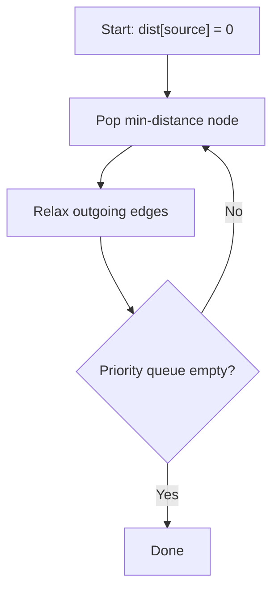

## Basic Explanation

Dijkstra computes minimum distance from one source node to all reachable nodes when edge weights are non-negative.

It repeatedly finalizes the currently closest unsettled node.

## Detailed Explanation

### Invariant

When a node is extracted as the minimum distance from the priority queue, its shortest path is finalized.

### Complexity

Using adjacency list + binary heap:

| Metric | Value |
| --- | --- |
| Time | O((V + E) log V) |
| Space | O(V + E) |

## Illustration



## Pseudocode

```text
dist[*] = inf
parent[*] = none
dist[source] = 0
push (0, source)
while heap not empty:
  (d, u) = pop min
  if d > dist[u]: continue
  for each (v, w) in edges[u]:
    if dist[u] + w < dist[v]:
      dist[v] = dist[u] + w
      parent[v] = u
      push (dist[v], v)
```

## Edge Cases

1. Negative edge weights:
   Dijkstra is not correct with negative weights; use Bellman-Ford or Johnson variants instead.
2. Unreachable nodes:
   Distances remain infinity/sentinel. APIs should represent this clearly (`-1`, `inf`, or `None`).
3. Stale heap entries:
   The same node can appear multiple times in heap. The `if d > dist[u]: continue` guard is required.
4. Overflow in distance accumulation:
   `dist[u] + w` may overflow in fixed-width types; saturating or wider arithmetic may be necessary.
5. Zero-weight edges:
   Fully valid; algorithm still works but may create many equal-priority heap entries.

## Animated Walkthroughs

<div class="operation-anim">
  <p class="operation-anim-title">Part Animation: Edge Relaxation</p>
  <div class="op-step">1. Pop node u with current minimum tentative distance.</div>
  <div class="op-step">2. Inspect outgoing edge (u, v, w).</div>
  <div class="op-step">3. Compute candidate distance dist[u] + w.</div>
  <div class="op-step">4. If candidate improves dist[v], update dist[v].</div>
  <div class="op-step">5. Push updated (dist[v], v) into priority queue.</div>
</div>

<div class="operation-anim">
  <p class="operation-anim-title">Full Animation: One Complete Dijkstra Run</p>
  <div class="op-step">1. Initialize all distances to inf except source=0.</div>
  <div class="op-step">2. Repeatedly pop closest unsettled node from heap.</div>
  <div class="op-step">3. Relax all outgoing edges from that node.</div>
  <div class="op-step">4. Skip stale heap entries using dist guard.</div>
  <div class="op-step">5. Terminate when heap empties; distances are final.</div>
</div>

<div class="operation-anim">
  <p class="operation-anim-title">Edge-Case Animation: Negative Edge Failure</p>
  <div class="op-step">1. Graph contains an edge with negative weight.</div>
  <div class="op-step">2. Node popped as minimum may later receive shorter path.</div>
  <div class="op-step">3. Finalization invariant breaks.</div>
  <div class="op-step">4. Output becomes incorrect for shortest paths.</div>
  <div class="op-step">5. Switch to Bellman-Ford for negative-weight graphs.</div>
</div>

## Full Examples

<div class="code-tabs">
<div class="tab-panel" data-lang="python" markdown="1">

```python
import heapq

Graph = dict[str, list[tuple[str, int]]]

def dijkstra(graph: Graph, source: str) -> dict[str, int]:
    dist = {node: float("inf") for node in graph}
    dist[source] = 0
    pq: list[tuple[int, str]] = [(0, source)]

    while pq:
        d, u = heapq.heappop(pq)
        if d > dist[u]:
            continue

        for v, w in graph[u]:
            nd = d + w
            if nd < dist[v]:
                dist[v] = nd
                heapq.heappush(pq, (nd, v))

    return {k: int(v) if v != float("inf") else -1 for k, v in dist.items()}

graph = {
    "A": [("B", 4), ("C", 1)],
    "B": [("D", 1)],
    "C": [("B", 2), ("D", 5)],
    "D": [],
}

print(dijkstra(graph, "A"))  # {'A': 0, 'B': 3, 'C': 1, 'D': 4}
```

</div>
<div class="tab-panel" data-lang="rust" markdown="1">

```rust
use std::cmp::Reverse;
use std::collections::{BinaryHeap, HashMap};

fn dijkstra(graph: &HashMap<&str, Vec<(&str, i32)>>, source: &str) -> HashMap<String, i32> {
    let mut dist: HashMap<&str, i32> = graph.keys().map(|&k| (k, i32::MAX)).collect();
    dist.insert(source, 0);

    let mut pq: BinaryHeap<Reverse<(i32, &str)>> = BinaryHeap::new();
    pq.push(Reverse((0, source)));

    while let Some(Reverse((d, u))) = pq.pop() {
        if d > *dist.get(u).unwrap_or(&i32::MAX) {
            continue;
        }

        if let Some(edges) = graph.get(u) {
            for &(v, w) in edges {
                let nd = d.saturating_add(w);
                if nd < *dist.get(v).unwrap_or(&i32::MAX) {
                    dist.insert(v, nd);
                    pq.push(Reverse((nd, v)));
                }
            }
        }
    }

    dist.into_iter().map(|(k, v)| (k.to_string(), v)).collect()
}

fn main() {
    let graph: HashMap<&str, Vec<(&str, i32)>> = HashMap::from([
        ("A", vec![("B", 4), ("C", 1)]),
        ("B", vec![("D", 1)]),
        ("C", vec![("B", 2), ("D", 5)]),
        ("D", vec![]),
    ]);

    println!("{:?}", dijkstra(&graph, "A"));
}
```

</div>
<div class="tab-panel" data-lang="go" markdown="1">

```go
package main

import (
    "container/heap"
    "fmt"
)

type edge struct {
    to string
    w  int
}

type item struct {
    node string
    dist int
}

type minHeap []item

func (h minHeap) Len() int            { return len(h) }
func (h minHeap) Less(i, j int) bool  { return h[i].dist < h[j].dist }
func (h minHeap) Swap(i, j int)       { h[i], h[j] = h[j], h[i] }
func (h *minHeap) Push(x any)         { *h = append(*h, x.(item)) }
func (h *minHeap) Pop() any {
    old := *h
    n := len(old)
    x := old[n-1]
    *h = old[:n-1]
    return x
}

func dijkstra(graph map[string][]edge, source string) map[string]int {
    const inf = int(^uint(0) >> 1)

    dist := map[string]int{}
    for k := range graph {
        dist[k] = inf
    }
    dist[source] = 0

    pq := &minHeap{}
    heap.Init(pq)
    heap.Push(pq, item{node: source, dist: 0})

    for pq.Len() > 0 {
        it := heap.Pop(pq).(item)
        if it.dist > dist[it.node] {
            continue
        }

        for _, e := range graph[it.node] {
            nd := it.dist + e.w
            if nd < dist[e.to] {
                dist[e.to] = nd
                heap.Push(pq, item{node: e.to, dist: nd})
            }
        }
    }

    return dist
}

func main() {
    graph := map[string][]edge{
        "A": []edge{edge{to: "B", w: 4}, edge{to: "C", w: 1}},
        "B": []edge{edge{to: "D", w: 1}},
        "C": []edge{edge{to: "B", w: 2}, edge{to: "D", w: 5}},
        "D": []edge{},
    }

    fmt.Println(dijkstra(graph, "A"))
}
```

</div>
</div>

## Advanced Cookbook Additions

### Decision Checklist Before Using Dijkstra

1. Are all edge weights non-negative?
2. Do you need single-source shortest paths or all-pairs?
3. Is graph sparse enough that heap-based implementation is appropriate?
4. Do you also need path reconstruction (parent tracking)?

### Reliability Pattern: Distance + Parent Arrays

Store both:

- `dist[v]`: shortest distance discovered
- `parent[v]`: predecessor on best-known path

This allows deterministic path reconstruction and easier debugging.

### Common Performance Improvements

1. Skip stale heap entries (`if popped_distance > dist[u]: continue`).
2. Use adjacency lists for sparse graphs.
3. Avoid repeated heap pushes for unchanged distances.
4. Use integer weights/types that avoid overflow for expected maxima.

### Failure Modes

1. Negative edge introduced by data bug silently invalidates correctness.
2. Integer overflow on large accumulated path sums.
3. Forgetting disconnected-node handling in output contract.
