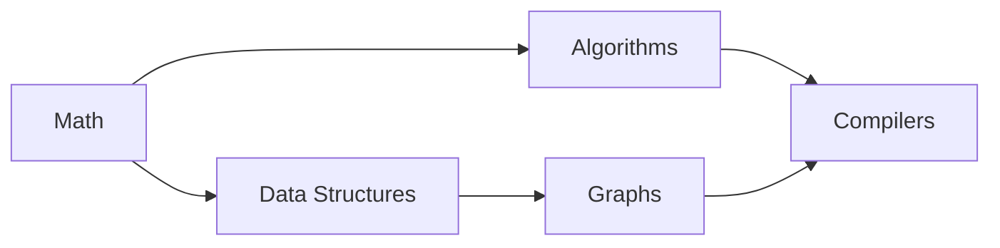

## Basic Explanation

Topological sorting applies to **directed acyclic graphs (DAGs)**.

It produces an order where for every edge `u -> v`, `u` appears before `v`.

If a directed cycle exists, no valid topological ordering exists.

## Detailed Explanation

### Kahn's Algorithm (In-degree Method)

1. Compute in-degree of every node.
2. Push all zero in-degree nodes into a queue.
3. Repeatedly pop queue front, append to output, and reduce in-degree of its neighbors.
4. Any neighbor whose in-degree becomes zero enters queue.

If output size is less than node count, graph has a cycle.

### Complexity

| Metric | Value |
| --- | --- |
| Time | O(V + E) |
| Space | O(V + E) |

## Illustration



One valid order: `Math, Data Structures, Algorithms, Graphs, Compilers`.

## Pseudocode

```text
indegree = count incoming edges for each vertex
queue = all vertices with indegree 0
order = []
while queue not empty:
  u = pop_front(queue)
  append u to order
  for v in neighbors(u):
    indegree[v] -= 1
    if indegree[v] == 0:
      push_back(queue, v)
if len(order) != number_of_vertices:
  cycle exists
return order
```

## Edge Cases

1. Graph with cycle:
   No valid topological order exists; algorithm must detect and report failure.
2. Multiple valid answers:
   Topological order is often non-unique; queue order affects output sequence.
3. Isolated vertices:
   Nodes with no incoming/outgoing edges must still appear in the final order.
4. Missing nodes in adjacency keys:
   Nodes appearing only in neighbor lists still need in-degree initialization.
5. Self-loop:
   A self-loop is a cycle of length 1, so topological sort must fail.

## Animated Walkthroughs

<div class="operation-anim">
  <p class="operation-anim-title">Part Animation: In-Degree Drain Step</p>
  <div class="op-step">1. Pop zero in-degree node u from queue.</div>
  <div class="op-step">2. Append u to topological output.</div>
  <div class="op-step">3. Decrement in-degree of each neighbor v.</div>
  <div class="op-step">4. Push v when in-degree becomes zero.</div>
  <div class="op-step">5. Continue with next queue node.</div>
</div>

<div class="operation-anim">
  <p class="operation-anim-title">Full Animation: Kahn End-to-End</p>
  <div class="op-step">1. Build indegree counts for all vertices.</div>
  <div class="op-step">2. Seed queue with all zero-indegree nodes.</div>
  <div class="op-step">3. Repeatedly pop and release outgoing constraints.</div>
  <div class="op-step">4. Grow output order incrementally.</div>
  <div class="op-step">5. Validate output size to detect cycle or success.</div>
</div>

<div class="operation-anim">
  <p class="operation-anim-title">Edge-Case Animation: Cycle Detection</p>
  <div class="op-step">1. Queue becomes empty before all nodes are output.</div>
  <div class="op-step">2. Remaining nodes still have positive indegree.</div>
  <div class="op-step">3. Those nodes are mutually constrained in cycle.</div>
  <div class="op-step">4. Algorithm reports cycle error instead of order.</div>
  <div class="op-step">5. Caller can surface invalid dependency graph.</div>
</div>

## Full Examples (Kahn's Algorithm)

<div class="code-tabs">
<div class="tab-panel" data-lang="python" markdown="1">

```python
from collections import deque

Graph = dict[str, list[str]]


def topo_sort_kahn(graph: Graph) -> list[str]:
    indegree: dict[str, int] = {}

    # Include all nodes from keys and neighbor lists.
    for u, nbrs in graph.items():
        indegree.setdefault(u, 0)
        for v in nbrs:
            indegree[v] = indegree.get(v, 0) + 1

    q = deque([node for node, deg in indegree.items() if deg == 0])
    order: list[str] = []

    while q:
        u = q.popleft()
        order.append(u)
        for v in graph.get(u, []):
            indegree[v] -= 1
            if indegree[v] == 0:
                q.append(v)

    if len(order) != len(indegree):
        raise ValueError("graph has a cycle")

    return order


graph = {
    "Math": ["Algorithms", "Data Structures"],
    "Algorithms": ["Compilers"],
    "Data Structures": ["Graphs"],
    "Graphs": ["Compilers"],
    "Compilers": [],
}

print(topo_sort_kahn(graph))
```

</div>
<div class="tab-panel" data-lang="rust" markdown="1">

```rust
use std::collections::{HashMap, VecDeque};

fn topo_sort_kahn(graph: &HashMap<&str, Vec<&str>>) -> Result<Vec<String>, &'static str> {
    let mut indegree: HashMap<&str, usize> = HashMap::new();

    // Include all nodes from keys and neighbor lists.
    for (&u, nbrs) in graph {
        indegree.entry(u).or_insert(0);
        for &v in nbrs {
            *indegree.entry(v).or_insert(0) += 1;
        }
    }

    let mut q = VecDeque::new();
    for (&node, &deg) in &indegree {
        if deg == 0 {
            q.push_back(node);
        }
    }

    let mut order: Vec<String> = Vec::new();
    while let Some(u) = q.pop_front() {
        order.push(u.to_string());
        if let Some(neighbors) = graph.get(u) {
            for &v in neighbors {
                if let Some(deg) = indegree.get_mut(v) {
                    *deg -= 1;
                    if *deg == 0 {
                        q.push_back(v);
                    }
                }
            }
        }
    }

    if order.len() != indegree.len() {
        return Err("graph has a cycle");
    }

    Ok(order)
}

fn main() {
    let graph: HashMap<&str, Vec<&str>> = HashMap::from([
        ("Math", vec!["Algorithms", "Data Structures"]),
        ("Algorithms", vec!["Compilers"]),
        ("Data Structures", vec!["Graphs"]),
        ("Graphs", vec!["Compilers"]),
        ("Compilers", vec![]),
    ]);

    println!("{:?}", topo_sort_kahn(&graph));
}
```

</div>
<div class="tab-panel" data-lang="go" markdown="1">

```go
package main

import (
    "errors"
    "fmt"
)

func topoSortKahn(graph map[string][]string) ([]string, error) {
    indegree := map[string]int{}

    // Include all nodes from keys and neighbor lists.
    for u, nbrs := range graph {
        if _, ok := indegree[u]; !ok {
            indegree[u] = 0
        }
        for _, v := range nbrs {
            indegree[v]++
        }
    }

    queue := []string{}
    for node, deg := range indegree {
        if deg == 0 {
            queue = append(queue, node)
        }
    }

    order := []string{}
    for len(queue) > 0 {
        u := queue[0]
        queue = queue[1:]
        order = append(order, u)

        for _, v := range graph[u] {
            indegree[v]--
            if indegree[v] == 0 {
                queue = append(queue, v)
            }
        }
    }

    if len(order) != len(indegree) {
        return nil, errors.New("graph has a cycle")
    }

    return order, nil
}

func main() {
    graph := map[string][]string{
        "Math":            {"Algorithms", "Data Structures"},
        "Algorithms":      {"Compilers"},
        "Data Structures": {"Graphs"},
        "Graphs":          {"Compilers"},
        "Compilers":       {},
    }

    order, err := topoSortKahn(graph)
    if err != nil {
        panic(err)
    }
    fmt.Println(order)
}
```

</div>
</div>

## DFS Variant (Alternative)

Another standard approach uses DFS with three-color state (`unvisited`, `visiting`, `visited`).

- Append node after visiting all descendants.
- Reverse final list to get topological order.
- Encountering an edge to a `visiting` node indicates a cycle.

## Advanced Cookbook Additions

### Selection Notes

Use topological sort when constraints are precedence edges in a DAG.

Examples:

- build pipelines
- task schedulers
- migration ordering
- compiler stage dependencies

### Determinism Guidance

Multiple valid topo orders often exist.

If deterministic output is required:

1. use stable queue discipline (e.g., lexicographic/min-heap)
2. document tie-breaking rules
3. test with graphs that have multiple valid orders

### Cycle Diagnostics Pattern

When cycle exists, provide actionable output:

- list nodes with unresolved in-degree
- include sample back-edge (if using DFS color tracking)
- map cycle to domain entities (task names, module names)

This turns "cycle detected" from vague error into debuggable feedback.
