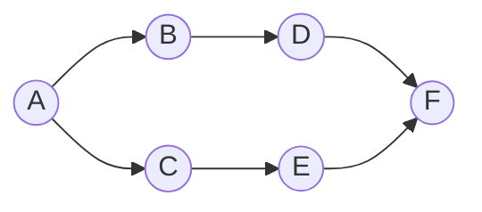

## Basic Explanation

- BFS explores graph by distance layers from start (queue).
- DFS explores as deep as possible before backtracking (stack/recursion).

## Detailed Explanation

### When To Use

- BFS: shortest path in unweighted graphs, level-order exploration.
- DFS: cycle detection, topological ideas, component exploration.

### Complexity

For adjacency list with `V` vertices and `E` edges:

| Algorithm | Time | Space |
| --- | --- | --- |
| BFS | O(V + E) | O(V) |
| DFS | O(V + E) | O(V) |

## Edge Cases

1. Disconnected graph:
   Starting from one node visits only one connected component. Loop over all nodes for full traversal.
2. Cycles:
   Missing `seen/visited` checks causes infinite loops or recursion blow-up.
3. Deep graph recursion (DFS):
   Recursive DFS may overflow call stack; iterative DFS with explicit stack is safer.
4. Directed vs undirected interpretation:
   Traversal result differs substantially depending on edge direction semantics.
5. Missing adjacency entries:
   If a node appears only as a neighbor and not as a key, traversal code should handle default empty neighbors.

## Illustration



## Full Examples

<div class="code-tabs">
<div class="tab-panel" data-lang="python" markdown="1">

```python
from collections import deque

graph = {
    "A": ["B", "C"],
    "B": ["D"],
    "C": ["E"],
    "D": ["F"],
    "E": ["F"],
    "F": [],
}

def bfs(start: str) -> list[str]:
    q = deque([start])
    seen = {start}
    order: list[str] = []

    while q:
        u = q.popleft()
        order.append(u)
        for v in graph[u]:
            if v not in seen:
                seen.add(v)
                q.append(v)
    return order

def dfs(start: str) -> list[str]:
    order: list[str] = []
    seen: set[str] = set()

    def rec(u: str) -> None:
        seen.add(u)
        order.append(u)
        for v in graph[u]:
            if v not in seen:
                rec(v)

    rec(start)
    return order

print(bfs("A"))
print(dfs("A"))
```

</div>
<div class="tab-panel" data-lang="rust" markdown="1">

```rust
use std::collections::{HashMap, HashSet, VecDeque};

fn bfs(graph: &HashMap<&str, Vec<&str>>, start: &str) -> Vec<String> {
    let mut q = VecDeque::new();
    let mut seen = HashSet::new();
    let mut order = Vec::new();

    q.push_back(start);
    seen.insert(start);

    while let Some(u) = q.pop_front() {
        order.push(u.to_string());
        if let Some(neighbors) = graph.get(u) {
            for &v in neighbors {
                if seen.insert(v) {
                    q.push_back(v);
                }
            }
        }
    }

    order
}

fn dfs(graph: &HashMap<&str, Vec<&str>>, start: &str) -> Vec<String> {
    fn rec(
        graph: &HashMap<&str, Vec<&str>>,
        u: &str,
        seen: &mut HashSet<String>,
        order: &mut Vec<String>,
    ) {
        seen.insert(u.to_string());
        order.push(u.to_string());
        if let Some(neighbors) = graph.get(u) {
            for &v in neighbors {
                if !seen.contains(v) {
                    rec(graph, v, seen, order);
                }
            }
        }
    }

    let mut seen = HashSet::new();
    let mut order = Vec::new();
    rec(graph, start, &mut seen, &mut order);
    order
}

fn main() {
    let graph: HashMap<&str, Vec<&str>> = HashMap::from([
        ("A", vec!["B", "C"]),
        ("B", vec!["D"]),
        ("C", vec!["E"]),
        ("D", vec!["F"]),
        ("E", vec!["F"]),
        ("F", vec![]),
    ]);

    println!("{:?}", bfs(&graph, "A"));
    println!("{:?}", dfs(&graph, "A"));
}
```

</div>
<div class="tab-panel" data-lang="go" markdown="1">

```go
package main

import "fmt"

func bfs(graph map[string][]string, start string) []string {
    q := []string{start}
    seen := map[string]bool{start: true}
    order := []string{}

    for len(q) > 0 {
        u := q[0]
        q = q[1:]
        order = append(order, u)
        for _, v := range graph[u] {
            if !seen[v] {
                seen[v] = true
                q = append(q, v)
            }
        }
    }
    return order
}

func dfs(graph map[string][]string, start string) []string {
    order := []string{}
    seen := map[string]bool{}

    var rec func(u string)
    rec = func(u string) {
        seen[u] = true
        order = append(order, u)
        for _, v := range graph[u] {
            if !seen[v] {
                rec(v)
            }
        }
    }

    rec(start)
    return order
}

func main() {
    graph := map[string][]string{
        "A": {"B", "C"},
        "B": {"D"},
        "C": {"E"},
        "D": {"F"},
        "E": {"F"},
        "F": {},
    }

    fmt.Println(bfs(graph, "A"))
    fmt.Println(dfs(graph, "A"))
}
```

</div>
</div>
