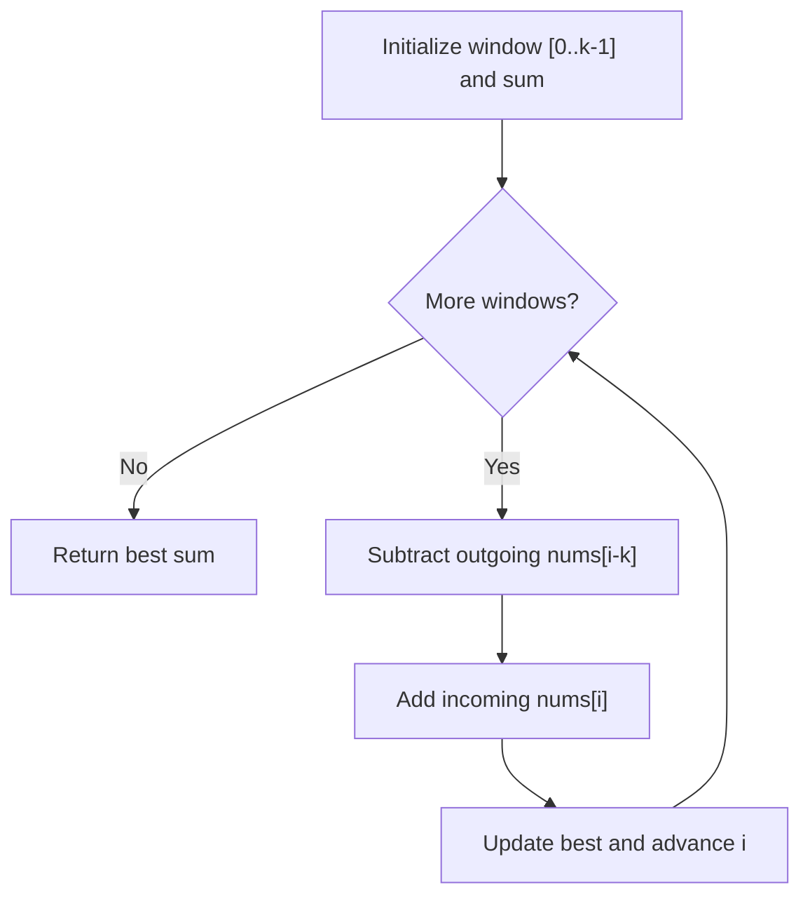

## Basic Explanation

Sliding window keeps state for a contiguous range and updates that state incrementally when the window moves.

Example: maximum sum of any size-`k` subarray.

## Detailed Explanation

### Invariant

At each position, maintain sum of current window `[i-k+1, i]`.

When window moves right by one:

- subtract outgoing element
- add incoming element

### Complexity

| Metric | Value |
| --- | --- |
| Time | O(n) |
| Extra space | O(1) |

## Illustration



## Pseudocode

```text
window_sum = sum(first k elements)
best = window_sum
for i from k to n-1:
  window_sum += nums[i] - nums[i-k]
  best = max(best, window_sum)
return best
```

## Edge Cases

1. Invalid `k`:
   `k <= 0` or `k > n` should raise/return an explicit error.
2. Negative numbers:
   Algorithm still works; do not assume sum increases as window moves.
3. `k == 1`:
   Result is simply max element.
4. `k == n`:
   Result is sum of full array with no slide iterations.
5. Integer overflow:
   In fixed-width integer languages, large values can overflow window sums unless wider types are used.

## Animated Walkthroughs

<div class="operation-anim">
  <p class="operation-anim-title">Part Animation: One Window Slide</p>
  <div class="op-step">1. Current window sum represents indices [L..R].</div>
  <div class="op-step">2. Subtract outgoing element at L.</div>
  <div class="op-step">3. Add incoming element at R+1.</div>
  <div class="op-step">4. Shift boundaries to [L+1..R+1].</div>
  <div class="op-step">5. Update best answer with new sum.</div>
</div>

<div class="operation-anim">
  <p class="operation-anim-title">Full Animation: Max Sum Window Scan</p>
  <div class="op-step">1. Compute initial size-k window sum.</div>
  <div class="op-step">2. Slide window across all valid positions.</div>
  <div class="op-step">3. Maintain running sum in O(1) per move.</div>
  <div class="op-step">4. Track global best during scan.</div>
  <div class="op-step">5. Return best sum after final window.</div>
</div>

<div class="operation-anim">
  <p class="operation-anim-title">Edge-Case Animation: Invalid k</p>
  <div class="op-step">1. k arrives as 0 or larger than array length.</div>
  <div class="op-step">2. Initial window cannot be formed safely.</div>
  <div class="op-step">3. Sliding logic would index out of bounds.</div>
  <div class="op-step">4. Validate k before any computation.</div>
  <div class="op-step">5. Return explicit error for invalid window size.</div>
</div>

## Full Examples

<div class="code-tabs">
<div class="tab-panel" data-lang="python" markdown="1">

```python
def max_sum_k(nums: list[int], k: int) -> int:
    if k <= 0 or k > len(nums):
        raise ValueError("k must be in [1, len(nums)]")

    window_sum = sum(nums[:k])
    best = window_sum

    for i in range(k, len(nums)):
        window_sum += nums[i] - nums[i - k]
        best = max(best, window_sum)

    return best

print(max_sum_k([2, 1, 5, 1, 3, 2], 3))  # 9
```

</div>
<div class="tab-panel" data-lang="rust" markdown="1">

```rust
fn max_sum_k(nums: &[i32], k: usize) -> Result<i32, &'static str> {
    if k == 0 || k > nums.len() {
        return Err("k must be in [1, len(nums)]");
    }

    let mut window_sum: i32 = nums[..k].iter().sum();
    let mut best = window_sum;

    for i in k..nums.len() {
        window_sum += nums[i] - nums[i - k];
        best = best.max(window_sum);
    }

    Ok(best)
}

fn main() {
    println!("{:?}", max_sum_k(&[2, 1, 5, 1, 3, 2], 3)); // Ok(9)
}
```

</div>
<div class="tab-panel" data-lang="go" markdown="1">

```go
package main

import (
    "errors"
    "fmt"
)

func maxSumK(nums []int, k int) (int, error) {
    if k <= 0 || k > len(nums) {
        return 0, errors.New("k must be in [1, len(nums)]")
    }

    windowSum := 0
    for i := 0; i < k; i++ {
        windowSum += nums[i]
    }
    best := windowSum

    for i := k; i < len(nums); i++ {
        windowSum += nums[i] - nums[i-k]
        if windowSum > best {
            best = windowSum
        }
    }

    return best, nil
}

func main() {
    ans, _ := maxSumK([]int{2, 1, 5, 1, 3, 2}, 3)
    fmt.Println(ans) // 9
}
```

</div>
</div>
