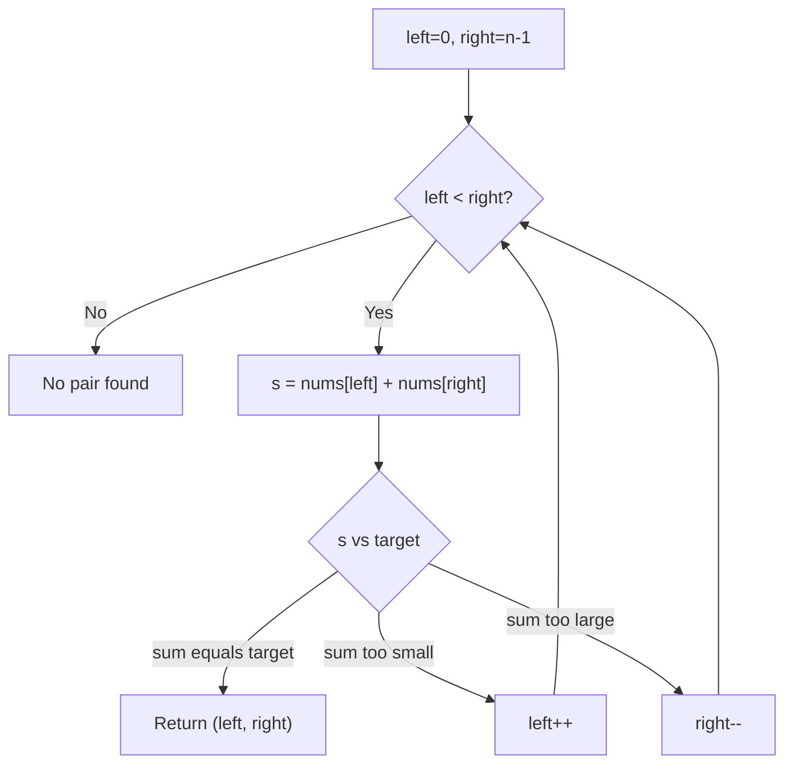

## Basic Explanation

Two pointers track two indices moving through a list with rules.

Classic example: find whether a sorted array has a pair summing to target.

## Detailed Explanation

### Invariant (Pair Sum in Sorted Array)

Let `left` start at `0` and `right` at `n-1`.

- If `nums[left] + nums[right]` is too small, move `left` rightward.
- If too large, move `right` leftward.
- If equal, success.

Because the array is sorted, each move safely eliminates impossible candidates.

### Complexity

| Metric | Value |
| --- | --- |
| Time | O(n) |
| Extra space | O(1) |

## Illustration



## Pseudocode

```text
left = 0, right = n - 1
while left < right:
  s = nums[left] + nums[right]
  if s == target: return (left, right)
  if s < target: left += 1
  else: right -= 1
return not found
```

## Edge Cases

1. Input not sorted:
   This specific invariant-based method is invalid without sorted order.
2. Arrays with duplicates:
   Works correctly, but if you need unique value pairs, add duplicate-skipping logic.
3. Negative numbers:
   Still valid for sorted arrays; no special handling needed.
4. Very small input (`n < 2`):
   Should return not found immediately.
5. Integer overflow in fixed-width languages:
   Sum `nums[left] + nums[right]` can overflow; use wider type/check when values can be large.

## Animated Walkthroughs

<div class="operation-anim">
  <p class="operation-anim-title">Part Animation: Pointer Move Rule</p>
  <div class="op-step">1. Compare sum of left and right values to target.</div>
  <div class="op-step">2. If sum too small, move left rightward.</div>
  <div class="op-step">3. If sum too large, move right leftward.</div>
  <div class="op-step">4. Recompute sum at new pair.</div>
  <div class="op-step">5. Repeat until found or pointers cross.</div>
</div>

<div class="operation-anim">
  <p class="operation-anim-title">Full Animation: End-to-End Pair Search</p>
  <div class="op-step">1. Initialize pointers at array extremes.</div>
  <div class="op-step">2. Eliminate impossible ranges using sorted-order logic.</div>
  <div class="op-step">3. Continue narrowing search interval.</div>
  <div class="op-step">4. Return matching indices when target met.</div>
  <div class="op-step">5. If pointers cross, report no valid pair.</div>
</div>

<div class="operation-anim">
  <p class="operation-anim-title">Edge-Case Animation: Input Not Sorted</p>
  <div class="op-step">1. Algorithm assumes sorted order for safe elimination.</div>
  <div class="op-step">2. Unsorted input breaks elimination invariant.</div>
  <div class="op-step">3. Pointer moves skip potentially valid pairs.</div>
  <div class="op-step">4. Result may be false negative.</div>
  <div class="op-step">5. Sort first or use hash-based two-sum approach.</div>
</div>

## Full Examples

<div class="code-tabs">
<div class="tab-panel" data-lang="python" markdown="1">

```python
def two_sum_sorted(nums: list[int], target: int) -> tuple[int, int] | None:
    left, right = 0, len(nums) - 1
    while left < right:
        s = nums[left] + nums[right]
        if s == target:
            return left, right
        if s < target:
            left += 1
        else:
            right -= 1
    return None

print(two_sum_sorted([1, 2, 4, 6, 10], 8))  # (1, 3)
```

</div>
<div class="tab-panel" data-lang="rust" markdown="1">

```rust
fn two_sum_sorted(nums: &[i32], target: i32) -> Option<(usize, usize)> {
    if nums.len() < 2 {
        return None;
    }

    let (mut left, mut right) = (0usize, nums.len() - 1);
    while left < right {
        let s = nums[left] + nums[right];
        if s == target {
            return Some((left, right));
        }
        if s < target {
            left += 1;
        } else {
            right -= 1;
        }
    }
    None
}

fn main() {
    println!("{:?}", two_sum_sorted(&[1, 2, 4, 6, 10], 8)); // Some((1, 3))
}
```

</div>
<div class="tab-panel" data-lang="go" markdown="1">

```go
package main

import "fmt"

func twoSumSorted(nums []int, target int) (int, int, bool) {
    if len(nums) < 2 {
        return 0, 0, false
    }

    left, right := 0, len(nums)-1
    for left < right {
        s := nums[left] + nums[right]
        if s == target {
            return left, right, true
        }
        if s < target {
            left++
        } else {
            right--
        }
    }

    return 0, 0, false
}

func main() {
    i, j, ok := twoSumSorted([]int{1, 2, 4, 6, 10}, 8)
    fmt.Println(i, j, ok) // 1 3 true
}
```

</div>
</div>
