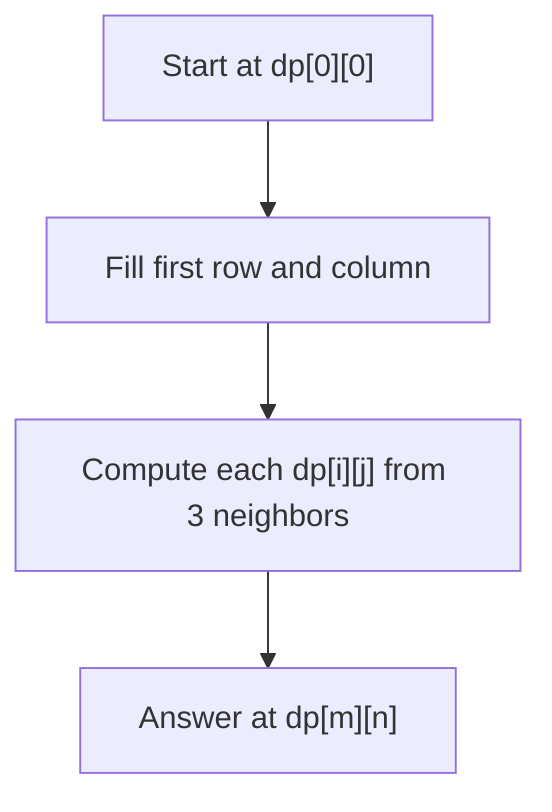

## Basic Explanation

Distance metrics quantify how different two strings are.

- Hamming distance: number of differing positions, only for equal-length strings.
- Levenshtein distance: minimum edits (insert, delete, substitute) to transform one string into another.

## Detailed Explanation

### Hamming Distance

If `a` and `b` have same length `n`, compare position-by-position.

- Time: O(n)
- Space: O(1)

### Levenshtein Distance

Dynamic programming over prefixes.

`dp[i][j]` = minimum edits to convert `a[:i]` to `b[:j]`.

Transition:

- delete: `dp[i-1][j] + 1`
- insert: `dp[i][j-1] + 1`
- substitute/match: `dp[i-1][j-1] + cost`

- Time: O(mn)
- Space: O(mn), reducible to O(min(m, n)) with rolling rows

## Illustration



## Pseudocode (Levenshtein)

```text
initialize dp of size (m+1) x (n+1)
for i in [0..m]: dp[i][0] = i
for j in [0..n]: dp[0][j] = j
for i in [1..m]:
  for j in [1..n]:
    cost = 0 if a[i-1] == b[j-1] else 1
    dp[i][j] = min(
      dp[i-1][j] + 1,
      dp[i][j-1] + 1,
      dp[i-1][j-1] + cost
    )
return dp[m][n]
```

## Edge Cases

1. Hamming with unequal lengths:
   Hamming distance is undefined if strings are different lengths, so code should raise/return an error explicitly.
2. Empty strings:
   - Hamming(`""`, `""`) is `0`.
   - Levenshtein(`""`, `x`) is `len(x)` because every character must be inserted.
3. Unicode handling:
   Byte-based iteration can miscount characters in UTF-8 strings. Use code points/runes/chars for character-level distance.
4. Very large strings:
   Full Levenshtein matrix needs O(mn) memory; use rolling-row optimization when memory is constrained.
5. Domain-specific costs:
   Standard Levenshtein treats all edits as cost `1`; if substitutions/insertions have different costs, transition rules must change.

## Full Examples

<div class="code-tabs">
<div class="tab-panel" data-lang="python" markdown="1">

```python
def hamming(a: str, b: str) -> int:
    if len(a) != len(b):
        raise ValueError("Hamming distance requires equal-length strings")
    return sum(ch1 != ch2 for ch1, ch2 in zip(a, b))


def levenshtein(a: str, b: str) -> int:
    m, n = len(a), len(b)
    dp = [[0] * (n + 1) for _ in range(m + 1)]

    for i in range(m + 1):
        dp[i][0] = i
    for j in range(n + 1):
        dp[0][j] = j

    for i in range(1, m + 1):
        for j in range(1, n + 1):
            cost = 0 if a[i - 1] == b[j - 1] else 1
            dp[i][j] = min(
                dp[i - 1][j] + 1,
                dp[i][j - 1] + 1,
                dp[i - 1][j - 1] + cost,
            )

    return dp[m][n]

print(hamming("karolin", "kathrin"))         # 3
print(levenshtein("kitten", "sitting"))      # 3
```

</div>
<div class="tab-panel" data-lang="rust" markdown="1">

```rust
fn hamming(a: &str, b: &str) -> Result<usize, &'static str> {
    if a.chars().count() != b.chars().count() {
        return Err("Hamming distance requires equal-length strings");
    }
    Ok(a.chars().zip(b.chars()).filter(|(x, y)| x != y).count())
}

fn levenshtein(a: &str, b: &str) -> usize {
    let a_chars: Vec<char> = a.chars().collect();
    let b_chars: Vec<char> = b.chars().collect();
    let m = a_chars.len();
    let n = b_chars.len();

    let mut dp = vec![vec![0usize; n + 1]; m + 1];
    for (i, row) in dp.iter_mut().enumerate().take(m + 1) {
        row[0] = i;
    }
    for (j, cell) in dp[0].iter_mut().enumerate().take(n + 1) {
        *cell = j;
    }

    for i in 1..=m {
        for j in 1..=n {
            let cost = if a_chars[i - 1] == b_chars[j - 1] { 0 } else { 1 };
            dp[i][j] = (dp[i - 1][j] + 1)
                .min(dp[i][j - 1] + 1)
                .min(dp[i - 1][j - 1] + cost);
        }
    }

    dp[m][n]
}

fn main() {
    println!("{:?}", hamming("karolin", "kathrin")); // Ok(3)
    println!("{}", levenshtein("kitten", "sitting")); // 3
}
```

</div>
<div class="tab-panel" data-lang="go" markdown="1">

```go
package main

import (
    "errors"
    "fmt"
)

func hamming(a, b string) (int, error) {
    ar := []rune(a)
    br := []rune(b)
    if len(ar) != len(br) {
        return 0, errors.New("Hamming distance requires equal-length strings")
    }
    d := 0
    for i := range ar {
        if ar[i] != br[i] {
            d++
        }
    }
    return d, nil
}

func levenshtein(a, b string) int {
    ar := []rune(a)
    br := []rune(b)
    m, n := len(ar), len(br)

    dp := make([][]int, m+1)
    for i := range dp {
        dp[i] = make([]int, n+1)
    }

    for i := 0; i <= m; i++ {
        dp[i][0] = i
    }
    for j := 0; j <= n; j++ {
        dp[0][j] = j
    }

    for i := 1; i <= m; i++ {
        for j := 1; j <= n; j++ {
            cost := 0
            if ar[i-1] != br[j-1] {
                cost = 1
            }
            dp[i][j] = min(
                dp[i-1][j]+1,
                min(dp[i][j-1]+1, dp[i-1][j-1]+cost),
            )
        }
    }

    return dp[m][n]
}

func min(a, b int) int {
    if a < b {
        return a
    }
    return b
}

func main() {
    d, _ := hamming("karolin", "kathrin")
    fmt.Println(d)                            // 3
    fmt.Println(levenshtein("kitten", "sitting")) // 3
}
```

</div>
</div>
