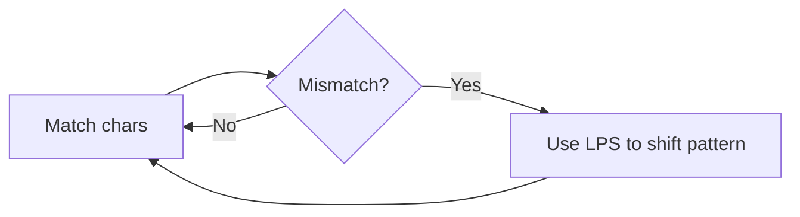

## Basic Explanation

KMP searches a pattern in text without re-checking characters unnecessarily.

It precomputes an LPS (longest prefix suffix) table for the pattern.

## Detailed Explanation

### Core Invariant

When mismatch occurs at pattern index `j`, jump to `lps[j-1]` instead of restarting at `0`.

This preserves information from previous matches.

### Complexity

| Phase | Time | Space |
| --- | --- | --- |
| Build LPS | O(m) | O(m) |
| Search | O(n) | O(1) extra |
| Total | O(n + m) | O(m) |

## Illustration



## Pseudocode

```text
build lps for pattern
i = 0, j = 0
while i < len(text):
  if text[i] == pattern[j]:
    i++, j++
    if j == len(pattern): report match at i-j; j = lps[j-1]
  else:
    if j != 0: j = lps[j-1]
    else: i++
```

## Edge Cases

1. Empty pattern:
   Many APIs define it as matching at every boundary (`0..len(text)`), which this page's implementation follows.
2. Pattern longer than text:
   Should return no matches immediately.
3. Highly repetitive patterns (e.g., `aaaaab`):
   This is where KMP shines; naive search backtracks heavily while KMP uses LPS fallback.
4. Overlapping matches:
   After a match, resetting `j = lps[j-1]` is required to catch overlaps (e.g., `ana` in `banana`).
5. Unicode/byte indexing:
   Byte-based logic is fine for raw byte search but can mismatch human character expectations for multibyte text.

## Full Examples

<div class="code-tabs">
<div class="tab-panel" data-lang="python" markdown="1">

```python
def build_lps(pattern: str) -> list[int]:
    lps = [0] * len(pattern)
    length = 0
    i = 1
    while i < len(pattern):
        if pattern[i] == pattern[length]:
            length += 1
            lps[i] = length
            i += 1
        elif length != 0:
            length = lps[length - 1]
        else:
            lps[i] = 0
            i += 1
    return lps


def kmp_search(text: str, pattern: str) -> list[int]:
    if not pattern:
        return list(range(len(text) + 1))

    lps = build_lps(pattern)
    matches: list[int] = []
    i = j = 0

    while i < len(text):
        if text[i] == pattern[j]:
            i += 1
            j += 1
            if j == len(pattern):
                matches.append(i - j)
                j = lps[j - 1]
        elif j != 0:
            j = lps[j - 1]
        else:
            i += 1

    return matches

print(kmp_search("ababcabcabababd", "ababd"))  # [10]
```

</div>
<div class="tab-panel" data-lang="rust" markdown="1">

```rust
fn build_lps(pattern: &[u8]) -> Vec<usize> {
    let mut lps = vec![0; pattern.len()];
    let mut len = 0usize;
    let mut i = 1usize;

    while i < pattern.len() {
        if pattern[i] == pattern[len] {
            len += 1;
            lps[i] = len;
            i += 1;
        } else if len != 0 {
            len = lps[len - 1];
        } else {
            lps[i] = 0;
            i += 1;
        }
    }
    lps
}

fn kmp_search(text: &str, pattern: &str) -> Vec<usize> {
    if pattern.is_empty() {
        return (0..=text.len()).collect();
    }

    let t = text.as_bytes();
    let p = pattern.as_bytes();
    let lps = build_lps(p);

    let (mut i, mut j) = (0usize, 0usize);
    let mut matches = Vec::new();

    while i < t.len() {
        if t[i] == p[j] {
            i += 1;
            j += 1;
            if j == p.len() {
                matches.push(i - j);
                j = lps[j - 1];
            }
        } else if j != 0 {
            j = lps[j - 1];
        } else {
            i += 1;
        }
    }

    matches
}

fn main() {
    println!("{:?}", kmp_search("ababcabcabababd", "ababd")); // [10]
}
```

</div>
<div class="tab-panel" data-lang="go" markdown="1">

```go
package main

import "fmt"

func buildLPS(pattern string) []int {
    p := []byte(pattern)
    lps := make([]int, len(p))
    length, i := 0, 1

    for i < len(p) {
        if p[i] == p[length] {
            length++
            lps[i] = length
            i++
        } else if length != 0 {
            length = lps[length-1]
        } else {
            lps[i] = 0
            i++
        }
    }
    return lps
}

func kmpSearch(text, pattern string) []int {
    if len(pattern) == 0 {
        out := make([]int, len(text)+1)
        for i := range out {
            out[i] = i
        }
        return out
    }

    t := []byte(text)
    p := []byte(pattern)
    lps := buildLPS(pattern)

    matches := []int{}
    i, j := 0, 0

    for i < len(t) {
        if t[i] == p[j] {
            i++
            j++
            if j == len(p) {
                matches = append(matches, i-j)
                j = lps[j-1]
            }
        } else if j != 0 {
            j = lps[j-1]
        } else {
            i++
        }
    }

    return matches
}

func main() {
    fmt.Println(kmpSearch("ababcabcabababd", "ababd")) // [10]
}
```

</div>
</div>
