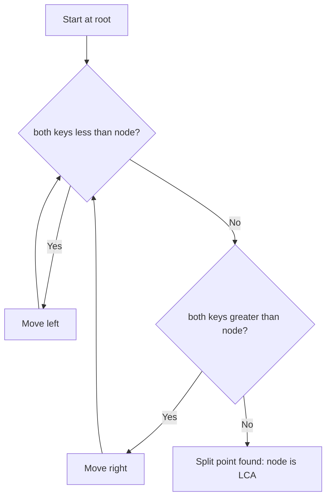

## Basic Explanation

Lowest Common Ancestor (LCA) of nodes `p` and `q` is the deepest node that is ancestor of both.

This page shows the BST version, which is simpler and efficient.

## Detailed Explanation

### BST Property Shortcut

At node `x`:

- if `p` and `q` are both smaller than `x`, move left
- if both larger, move right
- otherwise, `x` is the split point and LCA

### Complexity

| Metric | Value |
| --- | --- |
| Time | O(h) |
| Space | O(1) iterative |

For balanced BST, `h = O(log n)`; for skewed BST, `h = O(n)`.

## Illustration



## Edge Cases

1. One node is ancestor of the other:
   The ancestor node itself is the LCA and should be returned immediately at split condition.
2. `p == q`:
   LCA is that same node (if present in tree).
3. One or both keys absent:
   Basic BST shortcut logic may still return a split node even when a key is missing; validate key existence when required by API contract.
4. Skewed BST:
   Runtime can degrade to O(n), matching linked-list-like height.
5. Root as LCA:
   Very common when keys fall into different root subtrees; this is expected behavior, not a special error path.

## Animated Walkthroughs

<div class="operation-anim">
  <p class="operation-anim-title">Part Animation: BST Split-Point Rule</p>
  <div class="op-step">1. Compare p and q against current node key.</div>
  <div class="op-step">2. If both smaller, move left.</div>
  <div class="op-step">3. If both larger, move right.</div>
  <div class="op-step">4. Otherwise current node is split point.</div>
  <div class="op-step">5. Return current node as LCA.</div>
</div>

<div class="operation-anim">
  <p class="operation-anim-title">Full Animation: LCA Query Run</p>
  <div class="op-step">1. Start at BST root.</div>
  <div class="op-step">2. Descend using dual-side comparisons for p and q.</div>
  <div class="op-step">3. Narrow search to one subtree when both on same side.</div>
  <div class="op-step">4. Stop at first divergence or ancestor equality.</div>
  <div class="op-step">5. Return LCA node key.</div>
</div>

<div class="operation-anim">
  <p class="operation-anim-title">Edge-Case Animation: Missing Key Validation</p>
  <div class="op-step">1. Traversal finds split point for p and q values.</div>
  <div class="op-step">2. But one key is not actually present in tree.</div>
  <div class="op-step">3. Naive shortcut returns misleading LCA.</div>
  <div class="op-step">4. Optional pre-check verifies both keys exist.</div>
  <div class="op-step">5. API returns explicit not-found when needed.</div>
</div>

## Pseudocode

```text
cur = root
while cur != null:
  if p < cur and q < cur: cur = cur.left
  else if p > cur and q > cur: cur = cur.right
  else: return cur
```

## Full Examples

<div class="code-tabs">
<div class="tab-panel" data-lang="python" markdown="1">

```python
from dataclasses import dataclass
from typing import Optional

@dataclass
class Node:
    key: int
    left: Optional["Node"] = None
    right: Optional["Node"] = None

def lca_bst(root: Optional[Node], p: int, q: int) -> Optional[Node]:
    cur = root
    while cur is not None:
        if p < cur.key and q < cur.key:
            cur = cur.left
        elif p > cur.key and q > cur.key:
            cur = cur.right
        else:
            return cur
    return None

root = Node(20,
    left=Node(10, Node(5), Node(14)),
    right=Node(30, Node(25), Node(35)),
)

ans = lca_bst(root, 5, 14)
print(ans.key if ans else None)  # 10
```

</div>
<div class="tab-panel" data-lang="rust" markdown="1">

```rust
#[derive(Debug)]
struct Node {
    key: i32,
    left: Option<Box<Node>>,
    right: Option<Box<Node>>,
}

fn lca_bst(root: &Option<Box<Node>>, p: i32, q: i32) -> Option<i32> {
    let mut cur = root.as_ref();
    while let Some(n) = cur {
        if p < n.key && q < n.key {
            cur = n.left.as_ref();
        } else if p > n.key && q > n.key {
            cur = n.right.as_ref();
        } else {
            return Some(n.key);
        }
    }
    None
}

fn main() {
    let root = Some(Box::new(Node {
        key: 20,
        left: Some(Box::new(Node {
            key: 10,
            left: Some(Box::new(Node { key: 5, left: None, right: None })),
            right: Some(Box::new(Node { key: 14, left: None, right: None })),
        })),
        right: Some(Box::new(Node {
            key: 30,
            left: Some(Box::new(Node { key: 25, left: None, right: None })),
            right: Some(Box::new(Node { key: 35, left: None, right: None })),
        })),
    }));

    println!("{:?}", lca_bst(&root, 5, 14)); // Some(10)
}
```

</div>
<div class="tab-panel" data-lang="go" markdown="1">

```go
package main

import "fmt"

type Node struct {
    Key         int
    Left, Right *Node
}

func lcaBST(root *Node, p, q int) *Node {
    cur := root
    for cur != nil {
        if p < cur.Key && q < cur.Key {
            cur = cur.Left
        } else if p > cur.Key && q > cur.Key {
            cur = cur.Right
        } else {
            return cur
        }
    }
    return nil
}

func main() {
    root := &Node{20,
        &Node{10, &Node{5, nil, nil}, &Node{14, nil, nil}},
        &Node{30, &Node{25, nil, nil}, &Node{35, nil, nil}},
    }

    ans := lcaBST(root, 5, 14)
    fmt.Println(ans.Key) // 10
}
```

</div>
</div>
