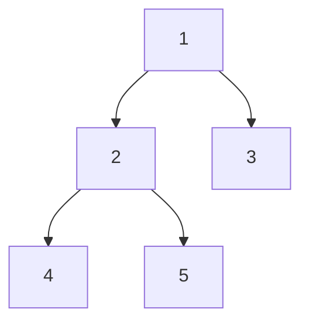

## Basic Explanation

For a binary tree node `N`:

- Preorder: `N, Left, Right`
- Inorder: `Left, N, Right`
- Postorder: `Left, Right, N`

These differ only in when you visit the current node relative to its children.

## Detailed Explanation

### Why Multiple Approaches Exist

- Recursive traversals are simplest to read.
- Iterative traversals avoid recursion-depth limits and make control flow explicit.
- Morris traversals perform inorder/preorder in O(1) extra space by temporarily threading pointers.

### Complexity

| Approach | Time | Extra Space | Notes |
| --- | --- | --- | --- |
| Recursive DFS | O(n) | O(h) | `h` is tree height (call stack) |
| Iterative DFS (stack) | O(n) | O(h) | Explicit stack instead of call stack |
| Morris (inorder/preorder) | O(n) | O(1) | Temporarily rewires right pointers |

## Edge Cases

1. Empty tree:
   Every traversal variant should return an empty sequence without errors.
2. Single-node tree:
   Preorder, inorder, and postorder all return the same one-element output.
3. Highly skewed tree:
   Recursive traversals can overflow call stack; iterative variants are safer.
4. Morris traversal restoration:
   Temporary threads must be removed; otherwise tree structure is corrupted after traversal.
5. Duplicate values:
   Traversal order remains structural, so duplicates are distinguished by position, not value uniqueness.
6. Concurrent mutation during traversal:
   Updating tree pointers while traversing can invalidate assumptions and produce undefined behavior.

## Illustration



- Preorder: `1,2,4,5,3`
- Inorder: `4,2,5,1,3`
- Postorder: `4,5,2,3,1`

## Recursive Traversals

### Pseudocode

```text
preorder(node):
  if node == null: return
  visit(node)
  preorder(node.left)
  preorder(node.right)

inorder(node):
  if node == null: return
  inorder(node.left)
  visit(node)
  inorder(node.right)

postorder(node):
  if node == null: return
  postorder(node.left)
  postorder(node.right)
  visit(node)
```

### Full Examples

<div class="code-tabs">
<div class="tab-panel" data-lang="python" markdown="1">

```python
from dataclasses import dataclass
from typing import Optional

@dataclass
class Node:
    val: int
    left: Optional["Node"] = None
    right: Optional["Node"] = None

def preorder(n: Optional[Node], out: list[int]) -> None:
    if not n:
        return
    out.append(n.val)
    preorder(n.left, out)
    preorder(n.right, out)

def inorder(n: Optional[Node], out: list[int]) -> None:
    if not n:
        return
    inorder(n.left, out)
    out.append(n.val)
    inorder(n.right, out)

def postorder(n: Optional[Node], out: list[int]) -> None:
    if not n:
        return
    postorder(n.left, out)
    postorder(n.right, out)
    out.append(n.val)

root = Node(1, Node(2, Node(4), Node(5)), Node(3))
pre, ino, post = [], [], []
preorder(root, pre)
inorder(root, ino)
postorder(root, post)
print(pre, ino, post)
```

</div>
<div class="tab-panel" data-lang="rust" markdown="1">

```rust
#[derive(Debug)]
struct Node {
    val: i32,
    left: Option<Box<Node>>,
    right: Option<Box<Node>>,
}

fn preorder(n: &Option<Box<Node>>, out: &mut Vec<i32>) {
    if let Some(node) = n {
        out.push(node.val);
        preorder(&node.left, out);
        preorder(&node.right, out);
    }
}

fn inorder(n: &Option<Box<Node>>, out: &mut Vec<i32>) {
    if let Some(node) = n {
        inorder(&node.left, out);
        out.push(node.val);
        inorder(&node.right, out);
    }
}

fn postorder(n: &Option<Box<Node>>, out: &mut Vec<i32>) {
    if let Some(node) = n {
        postorder(&node.left, out);
        postorder(&node.right, out);
        out.push(node.val);
    }
}

fn main() {
    let root = Some(Box::new(Node {
        val: 1,
        left: Some(Box::new(Node {
            val: 2,
            left: Some(Box::new(Node { val: 4, left: None, right: None })),
            right: Some(Box::new(Node { val: 5, left: None, right: None })),
        })),
        right: Some(Box::new(Node { val: 3, left: None, right: None })),
    }));

    let mut pre = Vec::new();
    let mut ino = Vec::new();
    let mut post = Vec::new();

    preorder(&root, &mut pre);
    inorder(&root, &mut ino);
    postorder(&root, &mut post);

    println!("{:?} {:?} {:?}", pre, ino, post);
}
```

</div>
<div class="tab-panel" data-lang="go" markdown="1">

```go
package main

import "fmt"

type Node struct {
    Val         int
    Left, Right *Node
}

func preorder(n *Node, out *[]int) {
    if n == nil {
        return
    }
    *out = append(*out, n.Val)
    preorder(n.Left, out)
    preorder(n.Right, out)
}

func inorder(n *Node, out *[]int) {
    if n == nil {
        return
    }
    inorder(n.Left, out)
    *out = append(*out, n.Val)
    inorder(n.Right, out)
}

func postorder(n *Node, out *[]int) {
    if n == nil {
        return
    }
    postorder(n.Left, out)
    postorder(n.Right, out)
    *out = append(*out, n.Val)
}

func main() {
    root := &Node{1,
        &Node{2, &Node{4, nil, nil}, &Node{5, nil, nil}},
        &Node{3, nil, nil},
    }

    pre, ino, post := []int{}, []int{}, []int{}
    preorder(root, &pre)
    inorder(root, &ino)
    postorder(root, &post)
    fmt.Println(pre, ino, post)
}
```

</div>
</div>

## Iterative Traversals (Stack-Based)

### Pseudocode (Inorder)

```text
stack = empty
cur = root
while cur != null or stack not empty:
  while cur != null:
    push cur
    cur = cur.left
  cur = pop stack
  visit(cur)
  cur = cur.right
```

### Full Examples

<div class="code-tabs">
<div class="tab-panel" data-lang="python" markdown="1">

```python
from dataclasses import dataclass
from typing import Optional

@dataclass
class Node:
    val: int
    left: Optional["Node"] = None
    right: Optional["Node"] = None

def preorder_iter(root: Optional[Node]) -> list[int]:
    if not root:
        return []
    out: list[int] = []
    stack: list[Node] = [root]
    while stack:
        n = stack.pop()
        out.append(n.val)
        if n.right:
            stack.append(n.right)
        if n.left:
            stack.append(n.left)
    return out


def inorder_iter(root: Optional[Node]) -> list[int]:
    out: list[int] = []
    stack: list[Node] = []
    cur = root
    while cur or stack:
        while cur:
            stack.append(cur)
            cur = cur.left
        cur = stack.pop()
        out.append(cur.val)
        cur = cur.right
    return out


def postorder_iter(root: Optional[Node]) -> list[int]:
    if not root:
        return []
    out: list[int] = []
    s1: list[Node] = [root]
    s2: list[Node] = []
    while s1:
        n = s1.pop()
        s2.append(n)
        if n.left:
            s1.append(n.left)
        if n.right:
            s1.append(n.right)
    while s2:
        out.append(s2.pop().val)
    return out

root = Node(1, Node(2, Node(4), Node(5)), Node(3))
print(preorder_iter(root))   # [1, 2, 4, 5, 3]
print(inorder_iter(root))    # [4, 2, 5, 1, 3]
print(postorder_iter(root))  # [4, 5, 2, 3, 1]
```

</div>
<div class="tab-panel" data-lang="rust" markdown="1">

```rust
#[derive(Debug)]
struct Node {
    val: i32,
    left: Option<Box<Node>>,
    right: Option<Box<Node>>,
}

fn preorder_iter(root: &Option<Box<Node>>) -> Vec<i32> {
    let mut out = Vec::new();
    let mut stack: Vec<&Node> = Vec::new();

    if let Some(r) = root.as_deref() {
        stack.push(r);
    }

    while let Some(n) = stack.pop() {
        out.push(n.val);
        if let Some(right) = n.right.as_deref() {
            stack.push(right);
        }
        if let Some(left) = n.left.as_deref() {
            stack.push(left);
        }
    }
    out
}

fn inorder_iter(root: &Option<Box<Node>>) -> Vec<i32> {
    let mut out = Vec::new();
    let mut stack: Vec<&Node> = Vec::new();
    let mut cur = root.as_deref();

    while cur.is_some() || !stack.is_empty() {
        while let Some(n) = cur {
            stack.push(n);
            cur = n.left.as_deref();
        }
        let n = stack.pop().expect("stack not empty");
        out.push(n.val);
        cur = n.right.as_deref();
    }
    out
}

fn postorder_iter(root: &Option<Box<Node>>) -> Vec<i32> {
    let mut out = Vec::new();
    let mut s1: Vec<&Node> = Vec::new();
    let mut s2: Vec<&Node> = Vec::new();

    if let Some(r) = root.as_deref() {
        s1.push(r);
    }

    while let Some(n) = s1.pop() {
        s2.push(n);
        if let Some(left) = n.left.as_deref() {
            s1.push(left);
        }
        if let Some(right) = n.right.as_deref() {
            s1.push(right);
        }
    }

    while let Some(n) = s2.pop() {
        out.push(n.val);
    }
    out
}

fn main() {
    let root = Some(Box::new(Node {
        val: 1,
        left: Some(Box::new(Node {
            val: 2,
            left: Some(Box::new(Node { val: 4, left: None, right: None })),
            right: Some(Box::new(Node { val: 5, left: None, right: None })),
        })),
        right: Some(Box::new(Node { val: 3, left: None, right: None })),
    }));

    println!("{:?}", preorder_iter(&root));
    println!("{:?}", inorder_iter(&root));
    println!("{:?}", postorder_iter(&root));
}
```

</div>
<div class="tab-panel" data-lang="go" markdown="1">

```go
package main

import "fmt"

type Node struct {
    Val         int
    Left, Right *Node
}

func preorderIter(root *Node) []int {
    if root == nil {
        return nil
    }
    out := []int{}
    stack := []*Node{root}
    for len(stack) > 0 {
        n := stack[len(stack)-1]
        stack = stack[:len(stack)-1]
        out = append(out, n.Val)
        if n.Right != nil {
            stack = append(stack, n.Right)
        }
        if n.Left != nil {
            stack = append(stack, n.Left)
        }
    }
    return out
}

func inorderIter(root *Node) []int {
    out := []int{}
    stack := []*Node{}
    cur := root

    for cur != nil || len(stack) > 0 {
        for cur != nil {
            stack = append(stack, cur)
            cur = cur.Left
        }
        n := stack[len(stack)-1]
        stack = stack[:len(stack)-1]
        out = append(out, n.Val)
        cur = n.Right
    }
    return out
}

func postorderIter(root *Node) []int {
    if root == nil {
        return nil
    }
    out := []int{}
    s1 := []*Node{root}
    s2 := []*Node{}

    for len(s1) > 0 {
        n := s1[len(s1)-1]
        s1 = s1[:len(s1)-1]
        s2 = append(s2, n)
        if n.Left != nil {
            s1 = append(s1, n.Left)
        }
        if n.Right != nil {
            s1 = append(s1, n.Right)
        }
    }

    for i := len(s2) - 1; i >= 0; i-- {
        out = append(out, s2[i].Val)
    }
    return out
}

func main() {
    root := &Node{1,
        &Node{2, &Node{4, nil, nil}, &Node{5, nil, nil}},
        &Node{3, nil, nil},
    }

    fmt.Println(preorderIter(root))
    fmt.Println(inorderIter(root))
    fmt.Println(postorderIter(root))
}
```

</div>
</div>

## Morris Traversal (Threaded, O(1) Extra Space)

### Key Idea

When a node has a left subtree, find its inorder predecessor (rightmost node in left subtree).

- If predecessor has no thread, point predecessor.right to current and move left.
- If predecessor.right already points to current, remove thread, visit current, move right.

This avoids an explicit stack and recursion.

### Pseudocode (Morris Inorder)

```text
cur = root
while cur != null:
  if cur.left == null:
    visit(cur)
    cur = cur.right
  else:
    pred = rightmost(cur.left) while pred.right != null and pred.right != cur
    if pred.right == null:
      pred.right = cur
      cur = cur.left
    else:
      pred.right = null
      visit(cur)
      cur = cur.right
```

### Full Examples (Inorder + Preorder)

<div class="code-tabs">
<div class="tab-panel" data-lang="python" markdown="1">

```python
from dataclasses import dataclass
from typing import Optional

@dataclass
class Node:
    val: int
    left: Optional["Node"] = None
    right: Optional["Node"] = None


def morris_inorder(root: Optional[Node]) -> list[int]:
    out: list[int] = []
    cur = root

    while cur:
        if cur.left is None:
            out.append(cur.val)
            cur = cur.right
        else:
            pred = cur.left
            while pred.right and pred.right is not cur:
                pred = pred.right
            if pred.right is None:
                pred.right = cur
                cur = cur.left
            else:
                pred.right = None
                out.append(cur.val)
                cur = cur.right

    return out


def morris_preorder(root: Optional[Node]) -> list[int]:
    out: list[int] = []
    cur = root

    while cur:
        if cur.left is None:
            out.append(cur.val)
            cur = cur.right
        else:
            pred = cur.left
            while pred.right and pred.right is not cur:
                pred = pred.right
            if pred.right is None:
                out.append(cur.val)
                pred.right = cur
                cur = cur.left
            else:
                pred.right = None
                cur = cur.right

    return out

root = Node(1, Node(2, Node(4), Node(5)), Node(3))
print(morris_inorder(root))   # [4, 2, 5, 1, 3]
print(morris_preorder(root))  # [1, 2, 4, 5, 3]
```

</div>
<div class="tab-panel" data-lang="rust" markdown="1">

```rust
use std::cell::RefCell;
use std::rc::Rc;

type Link = Option<Rc<RefCell<Node>>>;

#[derive(Debug)]
struct Node {
    val: i32,
    left: Link,
    right: Link,
}

fn new_node(val: i32) -> Rc<RefCell<Node>> {
    Rc::new(RefCell::new(Node {
        val,
        left: None,
        right: None,
    }))
}

fn morris_inorder(root: Link) -> Vec<i32> {
    let mut out = Vec::new();
    let mut cur = root;

    while let Some(cur_rc) = cur.clone() {
        let left = cur_rc.borrow().left.clone();
        if left.is_none() {
            out.push(cur_rc.borrow().val);
            cur = cur_rc.borrow().right.clone();
            continue;
        }

        let mut pred = left.expect("left exists");
        loop {
            let pred_right = pred.borrow().right.clone();
            match pred_right {
                Some(r) if !Rc::ptr_eq(&r, &cur_rc) => pred = r,
                _ => break,
            }
        }

        if pred.borrow().right.is_none() {
            pred.borrow_mut().right = Some(cur_rc.clone());
            cur = cur_rc.borrow().left.clone();
        } else {
            pred.borrow_mut().right = None;
            out.push(cur_rc.borrow().val);
            cur = cur_rc.borrow().right.clone();
        }
    }

    out
}

fn morris_preorder(root: Link) -> Vec<i32> {
    let mut out = Vec::new();
    let mut cur = root;

    while let Some(cur_rc) = cur.clone() {
        let left = cur_rc.borrow().left.clone();
        if left.is_none() {
            out.push(cur_rc.borrow().val);
            cur = cur_rc.borrow().right.clone();
            continue;
        }

        let mut pred = left.expect("left exists");
        loop {
            let pred_right = pred.borrow().right.clone();
            match pred_right {
                Some(r) if !Rc::ptr_eq(&r, &cur_rc) => pred = r,
                _ => break,
            }
        }

        if pred.borrow().right.is_none() {
            out.push(cur_rc.borrow().val);
            pred.borrow_mut().right = Some(cur_rc.clone());
            cur = cur_rc.borrow().left.clone();
        } else {
            pred.borrow_mut().right = None;
            cur = cur_rc.borrow().right.clone();
        }
    }

    out
}

fn main() {
    let n1 = new_node(1);
    let n2 = new_node(2);
    let n3 = new_node(3);
    let n4 = new_node(4);
    let n5 = new_node(5);

    n1.borrow_mut().left = Some(n2.clone());
    n1.borrow_mut().right = Some(n3.clone());
    n2.borrow_mut().left = Some(n4.clone());
    n2.borrow_mut().right = Some(n5.clone());

    println!("{:?}", morris_inorder(Some(n1.clone())));
    println!("{:?}", morris_preorder(Some(n1)));
}
```

</div>
<div class="tab-panel" data-lang="go" markdown="1">

```go
package main

import "fmt"

type Node struct {
    Val         int
    Left, Right *Node
}

func morrisInorder(root *Node) []int {
    out := []int{}
    cur := root

    for cur != nil {
        if cur.Left == nil {
            out = append(out, cur.Val)
            cur = cur.Right
        } else {
            pred := cur.Left
            for pred.Right != nil && pred.Right != cur {
                pred = pred.Right
            }
            if pred.Right == nil {
                pred.Right = cur
                cur = cur.Left
            } else {
                pred.Right = nil
                out = append(out, cur.Val)
                cur = cur.Right
            }
        }
    }

    return out
}

func morrisPreorder(root *Node) []int {
    out := []int{}
    cur := root

    for cur != nil {
        if cur.Left == nil {
            out = append(out, cur.Val)
            cur = cur.Right
        } else {
            pred := cur.Left
            for pred.Right != nil && pred.Right != cur {
                pred = pred.Right
            }
            if pred.Right == nil {
                out = append(out, cur.Val)
                pred.Right = cur
                cur = cur.Left
            } else {
                pred.Right = nil
                cur = cur.Right
            }
        }
    }

    return out
}

func main() {
    root := &Node{1,
        &Node{2, &Node{4, nil, nil}, &Node{5, nil, nil}},
        &Node{3, nil, nil},
    }

    fmt.Println(morrisInorder(root))  // [4 2 5 1 3]
    fmt.Println(morrisPreorder(root)) // [1 2 4 5 3]
}
```

</div>
</div>

### Morris Postorder Note

Morris postorder exists but is more intricate because it relies on temporary edge reversal along right boundaries.
In practice, teams usually prefer recursive or iterative postorder for maintainability.
