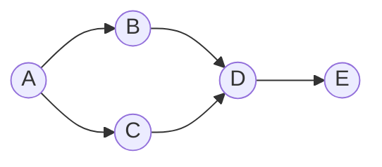

## Basic Explanation

A graph models entities and relationships:

- Vertices (nodes)
- Edges (connections)

Edges may be directed/undirected, weighted/unweighted.

## Big Picture

Graphs are the right model when "who is connected to whom" matters more than linear order.

Typical beginner mapping:

- cities + roads
- users + follows
- services + dependencies
- courses + prerequisites

The representation you choose controls which operations become fast.

## Detailed Explanation

### Common Representations

| Representation | Space | Edge Check | Iterate Neighbors |
| --- | --- | --- | --- |
| Adjacency list | O(V + E) | O(deg(v)) average | O(deg(v)) |
| Adjacency matrix | O(V^2) | O(1) | O(V) |

For sparse graphs, adjacency lists are usually the right default.

## Step-by-Step Representation Choice

### Adjacency List

1. Create one entry per node.
2. Store only existing outgoing neighbors.
3. Traverse by walking neighbor list.

Best for sparse graphs and most real systems.

### Adjacency Matrix

1. Allocate `V x V` table.
2. `matrix[u][v]` marks edge existence/weight.
3. Edge checks become direct table lookups.

Best when graph is dense or you need constant-time edge existence checks.

## Pros

- Models real relationship-heavy systems naturally.
- Supports a wide family of powerful algorithms (BFS/DFS/shortest path/MST/topological sort).
- Adjacency-list form is memory-efficient for sparse graphs.

## Cons

- Representation and algorithm choices are less obvious to beginners than arrays/lists.
- Dense graphs can consume large memory, especially with adjacency matrices.
- Edge direction and weight semantics can be mis-modeled if not specified clearly.

## Use Cases

- Routing and navigation networks
- Dependency resolution (build systems, courses, task pipelines)
- Social and recommendation graphs
- Service topology and distributed system analysis

## How The Pieces Fit Together

- Data structure layer: representation (list or matrix)
- Algorithm layer: BFS, DFS, shortest path, topological sort

If representation mismatches algorithm needs:

- you may waste memory (matrix on sparse graph)
- you may slow down neighbor scanning (matrix for traversal-heavy workloads)

## Worked Walkthrough

Given:

- `A -> B, C`
- `B -> D`
- `C -> D`
- `D -> E`

From `A`, BFS visits by distance layers:

1. start queue: `[A]`
2. visit `A`, enqueue `B,C`
3. visit `B`, enqueue `D`
4. visit `C`, `D` already discovered
5. visit `D`, enqueue `E`
6. visit `E`, done

Order: `A, B, C, D, E`.

## Edge Cases

1. Disconnected graph components:
   A traversal from one start node will not visit all nodes. Run traversal from each unvisited node if full coverage is required.
2. Self-loops (`u -> u`):
   Traversal code usually still works, but algorithms like topological sort must treat them as cycles in directed graphs.
3. Duplicate edges:
   May inflate degree counts and in some algorithms cause repeated work unless deduplicated.
4. Missing node keys in adjacency maps:
   If neighbor lists mention nodes not present as top-level keys, code should still initialize them to avoid key errors.
5. Directed vs undirected mismatch:
   Treating a directed graph as undirected (or vice versa) changes correctness of reachability and path algorithms.

## Animated Walkthroughs

<div class="operation-anim">
  <p class="operation-anim-title">Part Animation: BFS Queue Expansion</p>
  <div class="op-step">1. Initialize queue with start node A.</div>
  <div class="op-step">2. Dequeue A and enqueue unvisited neighbors B, C.</div>
  <div class="op-step">3. Dequeue B, enqueue D if unseen.</div>
  <div class="op-step">4. Dequeue C, skip D if already discovered.</div>
  <div class="op-step">5. Continue until queue empties and all reachable nodes are visited.</div>
</div>

<div class="operation-anim">
  <p class="operation-anim-title">Full Animation: Graph Pipeline</p>
  <div class="op-step">1. Build adjacency representation from input edges.</div>
  <div class="op-step">2. Initialize visited state and traversal worklist.</div>
  <div class="op-step">3. Repeatedly process nodes and expose new neighbors.</div>
  <div class="op-step">4. Apply algorithm logic (BFS/DFS/shortest path/topological constraints).</div>
  <div class="op-step">5. Emit final traversal order or computed graph result.</div>
</div>

<div class="operation-anim">
  <p class="operation-anim-title">Edge-Case Animation: Disconnected Components</p>
  <div class="op-step">1. Traversal starts from one component only.</div>
  <div class="op-step">2. Queue/stack empties before all nodes are seen.</div>
  <div class="op-step">3. Remaining nodes are in other disconnected components.</div>
  <div class="op-step">4. Outer loop picks new unvisited start node.</div>
  <div class="op-step">5. Combined runs cover full graph.</div>
</div>

### Illustration



## Full Examples (Adjacency List + BFS)

<div class="code-tabs">
<div class="tab-panel" data-lang="python" markdown="1">

```python
from collections import deque

graph: dict[str, list[str]] = {
    "A": ["B", "C"],
    "B": ["D"],
    "C": ["D"],
    "D": ["E"],
    "E": [],
}

def bfs(start: str) -> list[str]:
    q = deque([start])
    seen = {start}
    order: list[str] = []

    while q:
        u = q.popleft()
        order.append(u)
        for v in graph[u]:
            if v not in seen:
                seen.add(v)
                q.append(v)
    return order

print(bfs("A"))  # ['A', 'B', 'C', 'D', 'E']
```

</div>
<div class="tab-panel" data-lang="rust" markdown="1">

```rust
use std::collections::{HashMap, HashSet, VecDeque};

fn bfs(graph: &HashMap<&str, Vec<&str>>, start: &str) -> Vec<String> {
    let mut q = VecDeque::new();
    let mut seen = HashSet::new();
    let mut order = Vec::new();

    q.push_back(start);
    seen.insert(start);

    while let Some(u) = q.pop_front() {
        order.push(u.to_string());
        if let Some(neighbors) = graph.get(u) {
            for &v in neighbors {
                if seen.insert(v) {
                    q.push_back(v);
                }
            }
        }
    }
    order
}

fn main() {
    let graph: HashMap<&str, Vec<&str>> = HashMap::from([
        ("A", vec!["B", "C"]),
        ("B", vec!["D"]),
        ("C", vec!["D"]),
        ("D", vec!["E"]),
        ("E", vec![]),
    ]);

    println!("{:?}", bfs(&graph, "A"));
}
```

</div>
<div class="tab-panel" data-lang="go" markdown="1">

```go
package main

import "fmt"

func bfs(graph map[string][]string, start string) []string {
    q := []string{start}
    seen := map[string]bool{start: true}
    order := []string{}

    for len(q) > 0 {
        u := q[0]
        q = q[1:]
        order = append(order, u)

        for _, v := range graph[u] {
            if !seen[v] {
                seen[v] = true
                q = append(q, v)
            }
        }
    }
    return order
}

func main() {
    graph := map[string][]string{
        "A": {"B", "C"},
        "B": {"D"},
        "C": {"D"},
        "D": {"E"},
        "E": {},
    }

    fmt.Println(bfs(graph, "A")) // [A B C D E]
}
```

</div>
</div>
