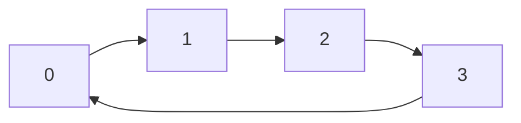

## Basic Explanation

A ring buffer is a fixed-size buffer where head/tail indices wrap around using modulo arithmetic.

- Enqueue writes at `tail`, then advances.
- Dequeue reads at `head`, then advances.

## Big Picture

Ring buffers are for bounded, continuous streams.

- You set a fixed capacity up front.
- Old data is evicted (or rejected) when full, depending on policy.
- Indexes wrap around instead of shifting memory.

This makes them a common primitive in networking, audio, telemetry, and producer-consumer pipelines.

## Detailed Explanation

### Complexity

| Operation | Time | Space |
| --- | --- | --- |
| Enqueue | O(1) | O(1) |
| Dequeue | O(1) | O(1) |
| Peek | O(1) | O(1) |

### Typical Uses

- Streaming pipelines
- Producer-consumer queues
- Bounded logging/telemetry buffers

## Pros

- O(1) enqueue/dequeue with fixed memory.
- Cache-friendly contiguous storage.
- No allocation churn after initialization.

## Cons

- Fixed capacity requires sizing decisions up front.
- Overflow policy (overwrite vs reject) must be explicit.
- Index arithmetic bugs are common in hand-rolled implementations.

## Use Cases

- Audio/video frame buffers
- Networking packet queues
- High-frequency telemetry windows
- Backpressure-aware producer-consumer channels

## Step-by-Step Mechanics

Assume capacity `4`, with `head` and `size`.

### Push

1. Compute write index: `(head + size) mod capacity`.
2. Write value at computed index.
3. If buffer not full: `size += 1`.
4. If full: advance `head` by one (oldest item overwritten).

### Read Current Values

1. Iterate `i` from `0` to `size-1`.
2. Physical index is `(head + i) mod capacity`.
3. Read values in logical FIFO order.

## How The Pieces Fit Together

- array provides compact fixed storage
- modular arithmetic provides wrap-around
- `head` + `size` defines current logical window

Because all operations touch only constant number of positions, enqueue/dequeue stay O(1).

## Worked Walkthrough

Capacity `4`, push values `10, 20, 30, 40, 50`:

1. after first four pushes: `[10, 20, 30, 40]`
2. push `50` while full:
   - overwrite oldest slot (`10`)
   - move `head` forward
3. logical buffer becomes `[20, 30, 40, 50]`

## Edge Cases

1. Zero capacity buffer:
   Must reject or no-op on writes; modulo by zero must never occur.
2. Full buffer semantics:
   Clarify whether new writes overwrite oldest data or fail.
3. Empty buffer read:
   Dequeue/peek should return explicit empty signal instead of garbage.
4. Wrap-around boundary:
   Off-by-one errors appear when `head` or `tail` crosses end of array.
5. Concurrent access:
   Multi-producer/multi-consumer use requires synchronization or lock-free protocol.

## Animated Walkthroughs

<div class="operation-anim">
  <p class="operation-anim-title">Part Animation: Wrap-Around Write</p>
  <div class="op-step">1. Tail reaches physical end of backing array.</div>
  <div class="op-step">2. Next write index wraps with modulo to slot 0.</div>
  <div class="op-step">3. New item is written at wrapped index.</div>
  <div class="op-step">4. Logical order is still tracked by head/size.</div>
  <div class="op-step">5. No data shifting occurs.</div>
</div>

<div class="operation-anim">
  <p class="operation-anim-title">Full Animation: Continuous Stream Cycle</p>
  <div class="op-step">1. Producer pushes values until buffer fills.</div>
  <div class="op-step">2. Consumer reads oldest logical values.</div>
  <div class="op-step">3. New pushes keep overwriting oldest when full.</div>
  <div class="op-step">4. Head advances to preserve FIFO window.</div>
  <div class="op-step">5. System runs in fixed memory with O(1) operations.</div>
</div>

<div class="operation-anim">
  <p class="operation-anim-title">Edge-Case Animation: Full Buffer Policy</p>
  <div class="op-step">1. Buffer reaches capacity and receives another push.</div>
  <div class="op-step">2. Overwrite policy: oldest item is dropped, head advances.</div>
  <div class="op-step">3. Reject policy: write is denied and state unchanged.</div>
  <div class="op-step">4. Downstream behavior depends on chosen policy.</div>
  <div class="op-step">5. Document policy to prevent data-loss surprises.</div>
</div>

### Illustration



## Full Examples

<div class="code-tabs">
<div class="tab-panel" data-lang="python" markdown="1">

```python
from collections import deque

# deque with maxlen behaves as a ring buffer.
rb = deque(maxlen=4)
for x in [10, 20, 30, 40, 50]:
    rb.append(x)  # oldest element is dropped automatically when full

print(list(rb))  # [20, 30, 40, 50]
```

</div>
<div class="tab-panel" data-lang="rust" markdown="1">

```rust
use std::collections::VecDeque;

fn main() {
    let mut rb: VecDeque<i32> = VecDeque::with_capacity(4);

    for x in [10, 20, 30, 40, 50] {
        if rb.len() == 4 {
            rb.pop_front();
        }
        rb.push_back(x);
    }

    println!("{:?}", rb); // [20, 30, 40, 50]
}
```

</div>
<div class="tab-panel" data-lang="go" markdown="1">

```go
package main

import "fmt"

type RingBuffer struct {
    data       []int
    head, size int
}

func NewRingBuffer(capacity int) *RingBuffer {
    return &RingBuffer{data: make([]int, capacity)}
}

func (r *RingBuffer) Push(v int) {
    if len(r.data) == 0 {
        return
    }
    idx := (r.head + r.size) % len(r.data)
    r.data[idx] = v
    if r.size < len(r.data) {
        r.size++
    } else {
        r.head = (r.head + 1) % len(r.data)
    }
}

func (r *RingBuffer) Values() []int {
    out := make([]int, r.size)
    for i := 0; i < r.size; i++ {
        out[i] = r.data[(r.head+i)%len(r.data)]
    }
    return out
}

func main() {
    rb := NewRingBuffer(4)
    for _, x := range []int{10, 20, 30, 40, 50} {
        rb.Push(x)
    }
    fmt.Println(rb.Values()) // [20 30 40 50]
}
```

</div>
</div>
