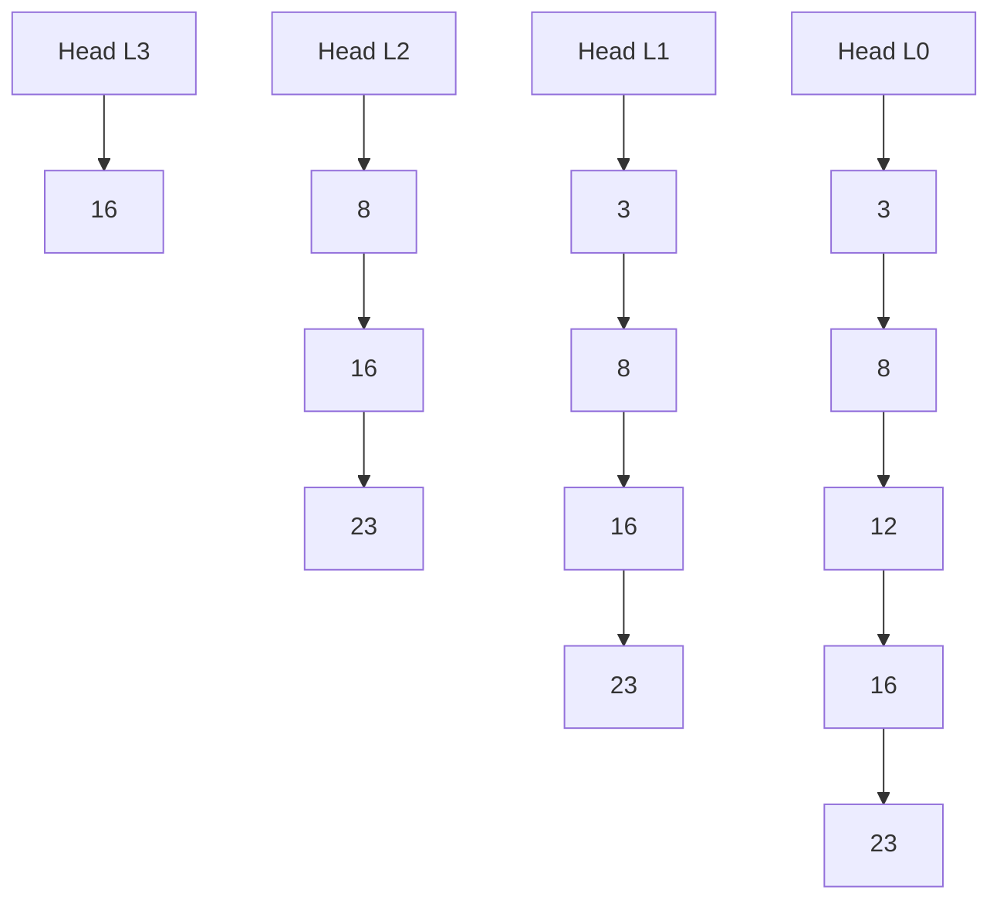

## Basic Explanation

A skip list is a tower of sorted linked lists.

- Level 0 contains every key.
- Higher levels contain sampled keys.
- Search starts at the highest level and drops down as needed.

## Big Picture

Skip lists provide balanced-tree-like expected performance without strict rebalancing rules.

- Trees rebalance via rotations.
- Skip lists rebalance probabilistically via random level promotion.

This makes implementation conceptually simpler while keeping expected logarithmic operations.

## Detailed Explanation

### Why It Works

Randomized level promotion creates logarithmic-height structure in expectation.

### Complexity (Expected)

| Operation | Time | Space |
| --- | --- | --- |
| Search | O(log n) | O(1) extra |
| Insert | O(log n) | O(log n) update path |
| Delete | O(log n) | O(log n) update path |

Worst-case can degrade to O(n), but randomized level generation keeps this rare.

## Pros

- Expected O(log n) search/insert/delete.
- Easier to implement than many self-balancing trees.
- Supports ordered operations (range scans, predecessor/successor).

## Cons

- Performance is probabilistic, not deterministic worst-case.
- More pointer overhead than simple linked lists.
- Randomness makes behavior less predictable for strict real-time constraints.

## Use Cases

- Ordered in-memory indices
- Systems where implementation simplicity matters more than strict worst-case guarantees
- Educational bridge between linked lists and balanced trees

## Step-by-Step Mechanics

### Search

1. Start at highest level head.
2. Move right while next key is still less than target.
3. When blocked, drop one level down.
4. Repeat until level 0, then check exact key.

### Insert

1. Run search while recording predecessor at each level (`update` array).
2. Generate random level for new key.
3. Splice new node into each level up to its random height.
4. Raise global list level if new node is highest so far.

### Delete (Conceptual)

1. Find predecessors at all levels for target key.
2. Rewire forward pointers to bypass target.
3. Drop top levels if they become empty.

## How The Pieces Fit Together

- Level 0 guarantees full sorted order.
- Upper levels act as express lanes to skip many nodes.
- Random promotion controls expected height and search path length.

The `update` path is the central mechanism used by both insert and delete.

## Edge Cases

1. Duplicate keys:
   Decide whether to ignore duplicates, replace value, or store multiset counts.
2. Very small `MAX_LEVEL`:
   Limits express lanes and can degrade performance on large datasets.
3. Pathological random sequences:
   Rare but possible near-linear behavior; fixed seeds in tests help reproducibility.
4. Deleting highest-level nodes:
   Must reduce current level when top lanes become empty.
5. Sentinel/head key choices:
   Head must compare lower than valid keys or use explicit sentinel logic.

### Illustration



## Pseudocode (Search)

```text
node = head at top_level
for level from top_level down to 0:
    while node.next[level] exists and node.next[level].key < target:
        node = node.next[level]
node = node.next[0]
return node != null and node.key == target
```

## Animated Walkthroughs

<div class="operation-anim">
  <p class="operation-anim-title">Part Animation: Search Across Levels</p>
  <div class="op-step">1. Start on highest express lane at head.</div>
  <div class="op-step">2. Move right while next key stays less than target.</div>
  <div class="op-step">3. Drop down one level when blocked.</div>
  <div class="op-step">4. Repeat until level 0 and perform final check.</div>
  <div class="op-step">5. Return found/not-found.</div>
</div>

<div class="operation-anim">
  <p class="operation-anim-title">Full Animation: Insert With Random Height</p>
  <div class="op-step">1. Traverse and record update path predecessors.</div>
  <div class="op-step">2. Roll random level for new node.</div>
  <div class="op-step">3. Splice node into each level from 0 to new level.</div>
  <div class="op-step">4. Raise global level if node is tallest.</div>
  <div class="op-step">5. Future searches can skip larger ranges.</div>
</div>

<div class="operation-anim">
  <p class="operation-anim-title">Edge-Case Animation: Top Level Shrink After Delete</p>
  <div class="op-step">1. Delete node that was sole occupant of top lane.</div>
  <div class="op-step">2. Top lane becomes empty.</div>
  <div class="op-step">3. Global current level is decremented.</div>
  <div class="op-step">4. Search now starts from next non-empty lane.</div>
  <div class="op-step">5. Structure remains valid and compact.</div>
</div>

## Full Examples

<div class="code-tabs">
<div class="tab-panel" data-lang="python" markdown="1">

```python
import random
from dataclasses import dataclass, field

MAX_LEVEL = 6
P = 0.5

@dataclass
class Node:
    key: int
    forward: list["Node | None"] = field(default_factory=list)

class SkipList:
    def __init__(self) -> None:
        self.level = 0
        self.head = Node(-10**9, [None] * (MAX_LEVEL + 1))

    def random_level(self) -> int:
        lvl = 0
        while random.random() < P and lvl < MAX_LEVEL:
            lvl += 1
        return lvl

    def search(self, key: int) -> bool:
        cur = self.head
        for lvl in range(self.level, -1, -1):
            while cur.forward[lvl] and cur.forward[lvl].key < key:
                cur = cur.forward[lvl]
        cur = cur.forward[0]
        return cur is not None and cur.key == key

    def insert(self, key: int) -> None:
        update = [self.head] * (MAX_LEVEL + 1)
        cur = self.head

        for lvl in range(self.level, -1, -1):
            while cur.forward[lvl] and cur.forward[lvl].key < key:
                cur = cur.forward[lvl]
            update[lvl] = cur

        cur = cur.forward[0]
        if cur and cur.key == key:
            return

        new_level = self.random_level()
        if new_level > self.level:
            for lvl in range(self.level + 1, new_level + 1):
                update[lvl] = self.head
            self.level = new_level

        node = Node(key, [None] * (new_level + 1))
        for lvl in range(new_level + 1):
            node.forward[lvl] = update[lvl].forward[lvl]
            update[lvl].forward[lvl] = node

sl = SkipList()
for x in [3, 8, 12, 16, 23]:
    sl.insert(x)
print(sl.search(12), sl.search(7))  # True False
```

</div>
<div class="tab-panel" data-lang="rust" markdown="1">

```rust
// Cargo.toml: rand = "0.8"
use rand::Rng;

const MAX_LEVEL: usize = 6;
const P: f64 = 0.5;

#[derive(Clone, Debug)]
struct Node {
    key: i32,
    forward: Vec<Option<usize>>, // index-based links into arena vector
}

#[derive(Debug)]
struct SkipList {
    level: usize,
    nodes: Vec<Node>,
}

impl SkipList {
    fn new() -> Self {
        Self {
            level: 0,
            nodes: vec![Node {
                key: i32::MIN,
                forward: vec![None; MAX_LEVEL + 1],
            }],
        }
    }

    fn random_level() -> usize {
        let mut rng = rand::thread_rng();
        let mut lvl = 0;
        while rng.gen_bool(P) && lvl < MAX_LEVEL {
            lvl += 1;
        }
        lvl
    }

    fn search(&self, key: i32) -> bool {
        let mut cur = 0usize;
        for lvl in (0..=self.level).rev() {
            while let Some(next) = self.nodes[cur].forward[lvl] {
                if self.nodes[next].key < key {
                    cur = next;
                } else {
                    break;
                }
            }
        }
        if let Some(next) = self.nodes[cur].forward[0] {
            self.nodes[next].key == key
        } else {
            false
        }
    }

    fn insert(&mut self, key: i32) {
        let mut update = vec![0usize; MAX_LEVEL + 1];
        let mut cur = 0usize;

        for lvl in (0..=self.level).rev() {
            while let Some(next) = self.nodes[cur].forward[lvl] {
                if self.nodes[next].key < key {
                    cur = next;
                } else {
                    break;
                }
            }
            update[lvl] = cur;
        }

        if let Some(next) = self.nodes[cur].forward[0] {
            if self.nodes[next].key == key {
                return;
            }
        }

        let new_level = Self::random_level();
        if new_level > self.level {
            for slot in update.iter_mut().take(new_level + 1).skip(self.level + 1) {
                *slot = 0;
            }
            self.level = new_level;
        }

        let new_index = self.nodes.len();
        self.nodes.push(Node {
            key,
            forward: vec![None; new_level + 1],
        });

        for (lvl, &u) in update.iter().enumerate().take(new_level + 1) {
            self.nodes[new_index].forward[lvl] = self.nodes[u].forward[lvl];
            self.nodes[u].forward[lvl] = Some(new_index);
        }
    }
}

fn main() {
    let mut sl = SkipList::new();
    for v in [3, 8, 12, 16, 23] {
        sl.insert(v);
    }
    println!("{} {}", sl.search(12), sl.search(7)); // true false
}
```

</div>
<div class="tab-panel" data-lang="go" markdown="1">

```go
package main

import (
    "fmt"
    "math/rand"
)

const (
    maxLevel = 6
    p        = 0.5
)

type node struct {
    key     int
    forward []*node
}

type SkipList struct {
    level int
    head  *node
}

func NewSkipList() *SkipList {
    return &SkipList{
        level: 0,
        head:  &node{key: -1 << 30, forward: make([]*node, maxLevel+1)},
    }
}

func randomLevel() int {
    lvl := 0
    for rand.Float64() < p && lvl < maxLevel {
        lvl++
    }
    return lvl
}

func (s *SkipList) Search(key int) bool {
    cur := s.head
    for lvl := s.level; lvl >= 0; lvl-- {
        for cur.forward[lvl] != nil && cur.forward[lvl].key < key {
            cur = cur.forward[lvl]
        }
    }
    cur = cur.forward[0]
    return cur != nil && cur.key == key
}

func (s *SkipList) Insert(key int) {
    update := make([]*node, maxLevel+1)
    cur := s.head

    for lvl := s.level; lvl >= 0; lvl-- {
        for cur.forward[lvl] != nil && cur.forward[lvl].key < key {
            cur = cur.forward[lvl]
        }
        update[lvl] = cur
    }

    if cur.forward[0] != nil && cur.forward[0].key == key {
        return
    }

    lvl := randomLevel()
    if lvl > s.level {
        for i := s.level + 1; i <= lvl; i++ {
            update[i] = s.head
        }
        s.level = lvl
    }

    n := &node{key: key, forward: make([]*node, lvl+1)}
    for i := 0; i <= lvl; i++ {
        n.forward[i] = update[i].forward[i]
        update[i].forward[i] = n
    }
}

func main() {
    sl := NewSkipList()
    for _, x := range []int{3, 8, 12, 16, 23} {
        sl.Insert(x)
    }
    fmt.Println(sl.Search(12), sl.Search(7)) // true false
}
```

</div>
</div>
