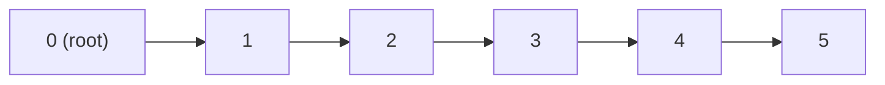
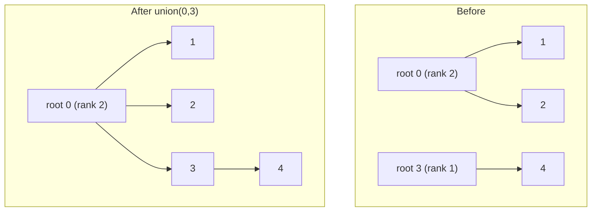
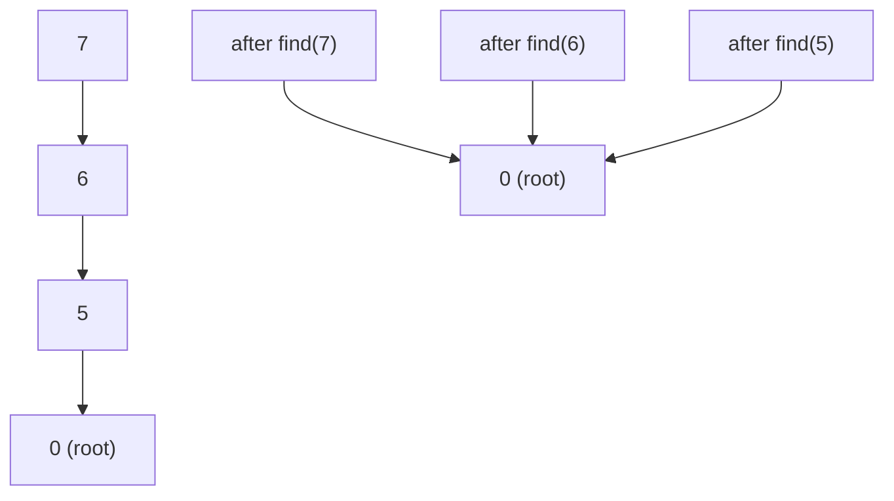

## Basic Explanation

Union-Find (also called DSU: Disjoint Set Union) tracks a collection of disjoint sets.

It supports three core operations:

- `make_set(x)`: start a new set containing `x`
- `find(x)`: return representative/root of `x`'s set
- `union(a, b)`: merge sets containing `a` and `b`

This is the standard tool for dynamic connectivity.

## Big Picture

Union-Find answers questions like:

- "Are these two nodes in the same component?"
- "After many merge operations, what components remain?"

Classic use cases:

1. Kruskal's minimum spanning tree algorithm.
2. Network connectivity (incremental edge additions).
3. Grouping equivalent entities (accounts, aliases, IDs).
4. Connected-component labeling in grids/images.

## Core Representation

Two arrays (or vectors/maps) are enough:

- `parent[i]`: parent pointer of node `i`
- `rank[i]` (or `size[i]`): heuristic metadata for balanced merges

Initially each node is its own parent (`parent[i] = i`).

## Mental Model (Built Slowly)

If you are new to Union-Find, use this model:

1. Every element points to a parent.
2. A **root** is an element that points to itself.
3. The root acts as the set representative.
4. Two elements are in the same set if they have the same root.
5. `union(a, b)` connects two roots so both sets become one set.

You can think of each set as a small tree:

- child nodes point upward
- root is the "set name"
- `find(x)` climbs up until it reaches the root

### Concrete Trace (Naive/Basic Version)

Start with 6 elements:

- `parent = [0, 1, 2, 3, 4, 5]`

Now apply operations:

| Operation | Root Decision | Parent Array After |
| --- | --- | --- |
| `union(0, 1)` | attach root(1) under root(0) | `[0, 0, 2, 3, 4, 5]` |
| `union(1, 2)` | root(1)=0, root(2)=2, attach 2 under 0 | `[0, 0, 0, 3, 4, 5]` |
| `union(3, 4)` | attach root(4) under root(3) | `[0, 0, 0, 3, 3, 5]` |
| `same(2, 4)` | root(2)=0, root(4)=3 | `False` (different sets) |
| `union(2, 4)` | root(2)=0, root(4)=3, attach 3 under 0 | `[0, 0, 0, 0, 3, 5]` |
| `same(2, 4)` | root(2)=0, root(4)=0 | `True` (same set) |

Notice: element `4` still points to `3`, and `3` points to `0`.
This is valid, because `find(4)` still reaches root `0`.

## Basic Union-Find (No Rank, No Path Compression)

This is the simplest correct implementation.

- `find`: walk parent pointers until root
- `union`: connect one root under the other root
- no balancing
- no path flattening

It is the best starting point for learning correctness before optimization.

### Basic Complexity

| Operation | Basic Union-Find |
| --- | --- |
| `make_set` | O(1) |
| `find` | O(h), worst-case O(n) |
| `union` | O(h), worst-case O(n) |
| Space | O(n) |

`h` is tree height. In the worst case, the tree can become a long chain.

### Why Basic Can Become Slow



In this shape, `find(5)` must walk through many pointers.

### Basic Code Example (Python, Rust, Go)

<div class="code-tabs">
<div class="tab-panel" data-lang="python" markdown="1">

```python
class BasicUnionFind:
    def __init__(self, n: int) -> None:
        if n <= 0:
            raise ValueError("n must be positive")
        self.parent = list(range(n))
        self.components = n

    def find(self, x: int) -> int:
        while self.parent[x] != x:
            x = self.parent[x]
        return x

    def union(self, a: int, b: int) -> bool:
        ra = self.find(a)
        rb = self.find(b)
        if ra == rb:
            return False
        self.parent[rb] = ra
        self.components -= 1
        return True

    def same(self, a: int, b: int) -> bool:
        return self.find(a) == self.find(b)


uf = BasicUnionFind(6)
uf.union(0, 1)
uf.union(1, 2)
uf.union(3, 4)
print(uf.same(2, 4))  # False
uf.union(2, 4)
print(uf.same(2, 4))  # True
print(uf.parent)      # One valid output: [0, 0, 0, 0, 3, 5]
```

</div>
<div class="tab-panel" data-lang="rust" markdown="1">

```rust
struct BasicUnionFind {
    parent: Vec<usize>,
    components: usize,
}

impl BasicUnionFind {
    fn new(n: usize) -> Self {
        assert!(n > 0, "n must be positive");
        Self {
            parent: (0..n).collect(),
            components: n,
        }
    }

    fn find(&self, mut x: usize) -> usize {
        while self.parent[x] != x {
            x = self.parent[x];
        }
        x
    }

    fn union(&mut self, a: usize, b: usize) -> bool {
        let ra = self.find(a);
        let rb = self.find(b);
        if ra == rb {
            return false;
        }
        self.parent[rb] = ra;
        self.components -= 1;
        true
    }

    fn same(&self, a: usize, b: usize) -> bool {
        self.find(a) == self.find(b)
    }
}

fn main() {
    let mut uf = BasicUnionFind::new(6);
    uf.union(0, 1);
    uf.union(1, 2);
    uf.union(3, 4);
    println!("{}", uf.same(2, 4)); // false
    uf.union(2, 4);
    println!("{}", uf.same(2, 4)); // true
    println!("{:?}", uf.parent);
}
```

</div>
<div class="tab-panel" data-lang="go" markdown="1">

```go
package main

import "fmt"

type BasicUnionFind struct {
	parent     []int
	components int
}

func NewBasicUnionFind(n int) *BasicUnionFind {
	if n <= 0 {
		panic("n must be positive")
	}
	parent := make([]int, n)
	for i := 0; i < n; i++ {
		parent[i] = i
	}
	return &BasicUnionFind{parent: parent, components: n}
}

func (uf *BasicUnionFind) Find(x int) int {
	for uf.parent[x] != x {
		x = uf.parent[x]
	}
	return x
}

func (uf *BasicUnionFind) Union(a, b int) bool {
	ra := uf.Find(a)
	rb := uf.Find(b)
	if ra == rb {
		return false
	}
	uf.parent[rb] = ra
	uf.components--
	return true
}

func (uf *BasicUnionFind) Same(a, b int) bool {
	return uf.Find(a) == uf.Find(b)
}

func main() {
	uf := NewBasicUnionFind(6)
	uf.Union(0, 1)
	uf.Union(1, 2)
	uf.Union(3, 4)
	fmt.Println(uf.Same(2, 4)) // false
	uf.Union(2, 4)
	fmt.Println(uf.Same(2, 4)) // true
	fmt.Println(uf.parent)
}
```

</div>
</div>

## Why Naive Union-Find Is Not Enough

Without heuristics, repeated unions can create long chains.

Then `find(x)` can degrade toward `O(n)` in worst cases.

Two optimizations fix this in practice:

1. **Union by Rank (or Size)**: attach shorter tree under taller tree.
2. **Path Compression**: during `find`, rewrite visited nodes to point directly to root.

Combined complexity is effectively near-constant amortized: `O(alpha(n))`, where `alpha` is inverse Ackermann.

## Complexity

| Operation | Naive | With rank + compression |
| --- | --- | --- |
| `make_set` | O(1) | O(1) |
| `find` | O(n) worst-case | O(alpha(n)) amortized |
| `union` | O(n) worst-case (via find) | O(alpha(n)) amortized |
| Space | O(n) | O(n) |

`alpha(n)` grows extremely slowly and is < 5 for realistic input sizes.

## Detailed Explanation

The optimized structure combines **union by rank** and **path compression** so trees stay shallow over time.
Together, they make repeated connectivity checks very fast in practice.

## Pros

- Extremely fast amortized operations for large connectivity workloads.
- Simple data layout (`parent`, optional `rank`/`size`) and low memory overhead.

## Cons

- Supports merges only; it does not support efficient edge deletions.
- Best suited for connectivity/equivalence queries, not general graph traversal.

## Step-by-Step: Union by Rank

Suppose roots are `ra` and `rb`:

1. If `rank[ra] < rank[rb]`, make `ra` child of `rb`.
2. If `rank[ra] > rank[rb]`, make `rb` child of `ra`.
3. If ranks equal, choose one as new root and increment its rank.

This prevents trees from becoming tall too quickly.

## Step-by-Step: Path Compression

During `find(x)`:

1. Traverse parent pointers until root.
2. On unwind, set each visited node's parent directly to root.

Future finds become much faster because paths flatten.

## Worked Optimized Trace (Rank + Compression)

Start:

- `parent = [0, 1, 2, 3, 4, 5, 6, 7]`
- `rank   = [0, 0, 0, 0, 0, 0, 0, 0]`

Run operations:

| Operation | What Happens | `parent` After | `rank` After |
| --- | --- | --- | --- |
| `union(0, 1)` | tie rank, attach 1 under 0, increment rank(0) | `[0, 0, 2, 3, 4, 5, 6, 7]` | `[1, 0, 0, 0, 0, 0, 0, 0]` |
| `union(2, 3)` | tie rank, attach 3 under 2, increment rank(2) | `[0, 0, 2, 2, 4, 5, 6, 7]` | `[1, 0, 1, 0, 0, 0, 0, 0]` |
| `union(1, 3)` | roots are 0 and 2 (same rank), attach 2 under 0, increment rank(0) | `[0, 0, 0, 2, 4, 5, 6, 7]` | `[2, 0, 1, 0, 0, 0, 0, 0]` |
| `find(3)` | path `3 -> 2 -> 0`, compress so 3 points to 0 | `[0, 0, 0, 0, 4, 5, 6, 7]` | `[2, 0, 1, 0, 0, 0, 0, 0]` |

Important beginner note:

- rank is a balancing heuristic, not always exact current tree height after many compressions.
- this is expected and still correct.

## Asymptotic Analysis (Novice-Friendly)

`find` and `union` cost depends on tree height.

- Basic Union-Find can grow tall trees.
- Tall tree means long parent-pointer walks.
- So repeated operations can become slow.

With both optimizations:

1. **Union by rank/size** avoids creating tall trees too quickly.
2. **Path compression** flattens trees during normal queries.

This gives amortized `O(alpha(n))` per operation.

- `alpha` is inverse Ackermann function.
- It grows so slowly that for practical sizes it is < 5.
- In engineering terms: "effectively constant" for most workloads.

For `m` operations over `n` elements:

- Basic worst-case: `O(mn)`
- Optimized (rank + compression): `O((n + m) * alpha(n))`

The second bound is why optimized Union-Find is standard in production and competitive programming.

## Fancy Diagrams

### Union by Rank (Balanced Merge)



### Path Compression Effect



After compression, repeated `find` calls are much shorter.

## Animated Walkthroughs

<div class="operation-anim">
  <p class="operation-anim-title">Part Animation: Union By Rank Merge</p>
  <div class="op-step">1. Find roots for both elements.</div>
  <div class="op-step">2. Compare rank (or size) metadata.</div>
  <div class="op-step">3. Attach lower-rank root under higher-rank root.</div>
  <div class="op-step">4. If ranks tie, choose one root and increment rank.</div>
  <div class="op-step">5. Component count decreases by one.</div>
</div>

<div class="operation-anim">
  <p class="operation-anim-title">Part Animation: Path Compression Find</p>
  <div class="op-step">1. Start find(x) and follow parent pointers upward.</div>
  <div class="op-step">2. Reach root representative.</div>
  <div class="op-step">3. Revisit path nodes and repoint each to root.</div>
  <div class="op-step">4. Future find calls skip intermediate nodes.</div>
  <div class="op-step">5. Tree becomes flatter and faster for later operations.</div>
</div>

<div class="operation-anim">
  <p class="operation-anim-title">Full Animation: Dynamic Connectivity Session</p>
  <div class="op-step">1. Initialize n singleton components.</div>
  <div class="op-step">2. Apply a stream of union operations.</div>
  <div class="op-step">3. Interleave same-component queries via find().</div>
  <div class="op-step">4. Path compression accelerates repeated queries.</div>
  <div class="op-step">5. Final component partition is returned.</div>
</div>

## Pseudocode

```text
make_set(x):
  parent[x] = x
  rank[x] = 0

find(x):
  if parent[x] != x:
    parent[x] = find(parent[x])
  return parent[x]

union(a, b):
  ra = find(a)
  rb = find(b)
  if ra == rb:
    return false

  if rank[ra] < rank[rb]:
    parent[ra] = rb
  else if rank[ra] > rank[rb]:
    parent[rb] = ra
  else:
    parent[rb] = ra
    rank[ra] += 1
  return true
```

## Full Examples

<div class="code-tabs">
<div class="tab-panel" data-lang="python" markdown="1">

```python
class UnionFind:
    def __init__(self, n: int) -> None:
        if n <= 0:
            raise ValueError("n must be positive")
        self.parent = list(range(n))
        self.rank = [0] * n
        self.components = n

    def find(self, x: int) -> int:
        if self.parent[x] != x:
            self.parent[x] = self.find(self.parent[x])
        return self.parent[x]

    def union(self, a: int, b: int) -> bool:
        ra = self.find(a)
        rb = self.find(b)
        if ra == rb:
            return False

        if self.rank[ra] < self.rank[rb]:
            self.parent[ra] = rb
        elif self.rank[ra] > self.rank[rb]:
            self.parent[rb] = ra
        else:
            self.parent[rb] = ra
            self.rank[ra] += 1

        self.components -= 1
        return True

    def same(self, a: int, b: int) -> bool:
        return self.find(a) == self.find(b)


# Demo
uf = UnionFind(8)
ops = [(0, 1), (1, 2), (3, 4), (2, 4), (6, 7)]
for a, b in ops:
    uf.union(a, b)

print(uf.same(0, 4))  # True
print(uf.same(5, 7))  # False
print(uf.components)  # 3
```

</div>
<div class="tab-panel" data-lang="rust" markdown="1">

```rust
struct UnionFind {
    parent: Vec<usize>,
    rank: Vec<usize>,
    components: usize,
}

impl UnionFind {
    fn new(n: usize) -> Self {
        assert!(n > 0, "n must be positive");
        Self {
            parent: (0..n).collect(),
            rank: vec![0; n],
            components: n,
        }
    }

    fn find(&mut self, x: usize) -> usize {
        if self.parent[x] != x {
            let root = self.find(self.parent[x]);
            self.parent[x] = root;
        }
        self.parent[x]
    }

    fn union(&mut self, a: usize, b: usize) -> bool {
        let ra = self.find(a);
        let rb = self.find(b);
        if ra == rb {
            return false;
        }

        if self.rank[ra] < self.rank[rb] {
            self.parent[ra] = rb;
        } else if self.rank[ra] > self.rank[rb] {
            self.parent[rb] = ra;
        } else {
            self.parent[rb] = ra;
            self.rank[ra] += 1;
        }

        self.components -= 1;
        true
    }

    fn same(&mut self, a: usize, b: usize) -> bool {
        self.find(a) == self.find(b)
    }
}

fn main() {
    let mut uf = UnionFind::new(8);
    let ops = vec![(0, 1), (1, 2), (3, 4), (2, 4), (6, 7)];
    for (a, b) in ops {
        uf.union(a, b);
    }

    println!("{}", uf.same(0, 4)); // true
    println!("{}", uf.same(5, 7)); // false
    println!("{}", uf.components); // 3
}
```

</div>
<div class="tab-panel" data-lang="go" markdown="1">

```go
package main

import "fmt"

type UnionFind struct {
	parent     []int
	rank       []int
	components int
}

func NewUnionFind(n int) *UnionFind {
	if n <= 0 {
		panic("n must be positive")
	}
	parent := make([]int, n)
	rank := make([]int, n)
	for i := 0; i < n; i++ {
		parent[i] = i
	}
	return &UnionFind{parent: parent, rank: rank, components: n}
}

func (uf *UnionFind) Find(x int) int {
	if uf.parent[x] != x {
		uf.parent[x] = uf.Find(uf.parent[x])
	}
	return uf.parent[x]
}

func (uf *UnionFind) Union(a, b int) bool {
	ra := uf.Find(a)
	rb := uf.Find(b)
	if ra == rb {
		return false
	}

	if uf.rank[ra] < uf.rank[rb] {
		uf.parent[ra] = rb
	} else if uf.rank[ra] > uf.rank[rb] {
		uf.parent[rb] = ra
	} else {
		uf.parent[rb] = ra
		uf.rank[ra]++
	}

	uf.components--
	return true
}

func (uf *UnionFind) Same(a, b int) bool {
	return uf.Find(a) == uf.Find(b)
}

func main() {
	uf := NewUnionFind(8)
	ops := [][2]int{
		{0, 1},
		{1, 2},
		{3, 4},
		{2, 4},
		{6, 7},
	}
	for _, op := range ops {
		uf.Union(op[0], op[1])
	}

	fmt.Println(uf.Same(0, 4)) // true
	fmt.Println(uf.Same(5, 7)) // false
	fmt.Println(uf.components) // 3
}
```

</div>
</div>

## Use Cases

### Kruskal's MST

Sort edges by weight and use Union-Find to skip edges that form cycles.

- if `find(u) != find(v)`, include edge and `union(u, v)`
- else skip edge

### Dynamic Connectivity Service

For a stream of edge additions and connectivity queries:

- union on edge add
- answer `connected(a,b)` with `find(a) == find(b)`

### Grid/Percolation Problems

Map 2D cell indices to 1D IDs, union neighbors that are open/active, and query connectivity between sentinel nodes.

## Edge Cases and Gotchas

1. **Out-of-range index**: always validate IDs in public APIs.
2. **Repeated union on same component**: should be a no-op (`False`/`false`).
3. **Recursion depth in Python**: recursive find is concise; iterative find may be safer for huge pathological inputs.
4. **Thread safety**: mutable parent/rank arrays need synchronization if shared.
5. **Deletion unsupported**: classic Union-Find handles merges, not split/remove operations.

## When Not to Use Union-Find

- you need to remove edges and maintain dynamic connectivity both ways
- you need shortest path or traversal order (BFS/DFS/Dijkstra fit better)
- you need component member enumeration very frequently without additional bookkeeping

## Practical Validation Checklist

1. Verify parent pointers always eventually lead to a root.
2. Verify component count only decreases on successful merges.
3. Add random test harness comparing against a naive connectivity model.
4. Benchmark with repeated query-heavy workloads to validate path compression benefit.
