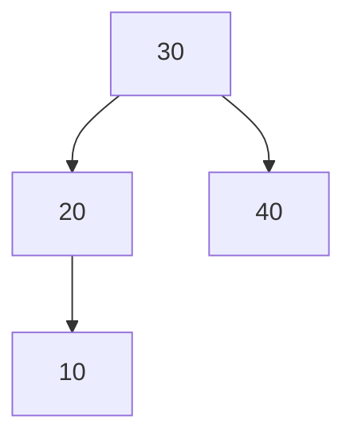

## Basic Explanation

An AVL tree is a BST where every node keeps a balance factor:

`height(left) - height(right)` must be in `{-1, 0, +1}`.

If insertion/deletion violates this, rotations restore balance.

## Big Picture

AVL is a BST with stricter balance than many alternatives.

- strict balance gives excellent lookup performance
- stricter balancing means more rotations during updates

Use AVL when read performance is very important and update overhead is acceptable.

## Pros

- Strong balance guarantee keeps lookups consistently fast.
- Deterministic O(log n) height bound.
- Good for read-heavy workloads with strict latency targets.

## Cons

- More rotations than red-black trees on many update patterns.
- Node stores extra height metadata.
- Implementation complexity is higher than plain BST.

## Use Cases

- In-memory indexes with frequent lookups
- Workloads needing tight worst-case lookup bounds
- Educational study of self-balancing rotation logic

## Detailed Explanation

### Complexity

| Operation | Time | Space |
| --- | --- | --- |
| Search | O(log n) | O(1) |
| Insert | O(log n) | O(log n) recursion |
| Delete | O(log n) | O(log n) recursion |

### Rotation Cases

- LL -> right rotation
- RR -> left rotation
- LR -> left rotate child, then right rotate node
- RL -> right rotate child, then left rotate node

## Operations Step-by-Step

### Search

Same as BST:

1. compare key with current node
2. move left or right
3. stop at match or null

### Insert

1. Insert like normal BST.
2. On recursion unwind, update each ancestor height.
3. Compute each ancestor balance factor.
4. If factor outside `[-1, 1]`, apply one of LL/LR/RR/RL rotations.
5. Continue up until root is valid again.

### Delete (Conceptual)

1. Delete like BST (0, 1, or 2 child case).
2. Update heights on way back up.
3. Rebalance each ancestor where needed.
4. Multiple rotations may be needed along path.

## How All Pieces Fit Together

- BST invariant provides ordered search path.
- Height metadata tells how balanced each node is.
- Rotation operations are local pointer rewrites that preserve in-order key order.

This combination gives predictable `O(log n)` height.

## Edge Cases

1. Cascading rebalances:
   One insert/delete can trigger rotations at multiple ancestors.
2. Duplicate keys:
   Must define whether duplicates are ignored or stored with counts.
3. Height update order bugs:
   Updating heights after rotation in wrong order yields incorrect balance factors.
4. Delete with two-child replacement:
   Replacement key move must be followed by rebalance on full path.
5. Extremely small trees:
   Rotation logic should handle null children safely without assumptions.

## Animated Operation Trace

<div class="operation-anim">
  <p class="operation-anim-title">AVL Insert Rebalance (LL Case)</p>
  <div class="op-step">1. Insert new key using BST descent.</div>
  <div class="op-step">2. Walk back up and update node heights.</div>
  <div class="op-step">3. Detect balance factor +2 at ancestor.</div>
  <div class="op-step">4. Child also left-heavy, so apply right rotation.</div>
  <div class="op-step">5. Heights recomputed, subtree balance restored.</div>
</div>

### Illustration



When this becomes left-heavy at `30`, rotate right around `30`.

## Full Examples (Insert + Search)

<div class="code-tabs">
<div class="tab-panel" data-lang="python" markdown="1">

```python
from __future__ import annotations
from dataclasses import dataclass
from typing import Optional

@dataclass
class Node:
    key: int
    height: int = 1
    left: Optional["Node"] = None
    right: Optional["Node"] = None

class AVL:
    def __init__(self) -> None:
        self.root: Optional[Node] = None

    def _h(self, n: Optional[Node]) -> int:
        return n.height if n else 0

    def _update(self, n: Node) -> None:
        n.height = 1 + max(self._h(n.left), self._h(n.right))

    def _bf(self, n: Node) -> int:
        return self._h(n.left) - self._h(n.right)

    def _rot_right(self, y: Node) -> Node:
        x = y.left
        assert x is not None
        t2 = x.right
        x.right = y
        y.left = t2
        self._update(y)
        self._update(x)
        return x

    def _rot_left(self, x: Node) -> Node:
        y = x.right
        assert y is not None
        t2 = y.left
        y.left = x
        x.right = t2
        self._update(x)
        self._update(y)
        return y

    def _rebalance(self, n: Node) -> Node:
        self._update(n)
        b = self._bf(n)

        if b > 1:
            if n.left and self._bf(n.left) < 0:
                n.left = self._rot_left(n.left)
            return self._rot_right(n)

        if b < -1:
            if n.right and self._bf(n.right) > 0:
                n.right = self._rot_right(n.right)
            return self._rot_left(n)

        return n

    def _insert(self, n: Optional[Node], key: int) -> Node:
        if n is None:
            return Node(key=key)
        if key < n.key:
            n.left = self._insert(n.left, key)
        elif key > n.key:
            n.right = self._insert(n.right, key)
        return self._rebalance(n)

    def insert(self, key: int) -> None:
        self.root = self._insert(self.root, key)

    def contains(self, key: int) -> bool:
        cur = self.root
        while cur is not None:
            if key == cur.key:
                return True
            cur = cur.left if key < cur.key else cur.right
        return False

avl = AVL()
for k in [30, 20, 40, 10, 25, 35, 50, 5]:
    avl.insert(k)
print(avl.contains(25), avl.contains(99))  # True False
```

</div>
<div class="tab-panel" data-lang="rust" markdown="1">

```rust
use std::cmp::max;

type Link = Option<Box<Node>>;

#[derive(Debug)]
struct Node {
    key: i32,
    height: i32,
    left: Link,
    right: Link,
}

impl Node {
    fn new(key: i32) -> Self {
        Self {
            key,
            height: 1,
            left: None,
            right: None,
        }
    }
}

#[derive(Debug, Default)]
struct Avl {
    root: Link,
}

impl Avl {
    fn h(n: &Link) -> i32 {
        n.as_ref().map_or(0, |n| n.height)
    }

    fn update(n: &mut Box<Node>) {
        n.height = 1 + max(Self::h(&n.left), Self::h(&n.right));
    }

    fn rotate_right(mut y: Box<Node>) -> Box<Node> {
        let mut x = y.left.take().expect("left child required");
        let t2 = x.right.take();
        y.left = t2;
        Self::update(&mut y);
        x.right = Some(y);
        Self::update(&mut x);
        x
    }

    fn rotate_left(mut x: Box<Node>) -> Box<Node> {
        let mut y = x.right.take().expect("right child required");
        let t2 = y.left.take();
        x.right = t2;
        Self::update(&mut x);
        y.left = Some(x);
        Self::update(&mut y);
        y
    }

    fn rebalance(mut n: Box<Node>) -> Box<Node> {
        Self::update(&mut n);
        let bf = Self::h(&n.left) - Self::h(&n.right);

        if bf > 1 {
            let left_left_h = n.left.as_ref().map_or(0, |l| Self::h(&l.left));
            let left_right_h = n.left.as_ref().map_or(0, |l| Self::h(&l.right));
            if left_right_h > left_left_h {
                let left = n.left.take().expect("left exists");
                n.left = Some(Self::rotate_left(left));
            }
            return Self::rotate_right(n);
        }

        if bf < -1 {
            let right_left_h = n.right.as_ref().map_or(0, |r| Self::h(&r.left));
            let right_right_h = n.right.as_ref().map_or(0, |r| Self::h(&r.right));
            if right_left_h > right_right_h {
                let right = n.right.take().expect("right exists");
                n.right = Some(Self::rotate_right(right));
            }
            return Self::rotate_left(n);
        }

        n
    }

    fn insert_rec(node: Link, key: i32) -> Box<Node> {
        match node {
            None => Box::new(Node::new(key)),
            Some(mut n) => {
                if key < n.key {
                    n.left = Some(Self::insert_rec(n.left.take(), key));
                } else if key > n.key {
                    n.right = Some(Self::insert_rec(n.right.take(), key));
                }
                Self::rebalance(n)
            }
        }
    }

    fn insert(&mut self, key: i32) {
        self.root = Some(Self::insert_rec(self.root.take(), key));
    }

    fn contains(&self, key: i32) -> bool {
        let mut cur = self.root.as_ref();
        while let Some(n) = cur {
            if key == n.key {
                return true;
            }
            cur = if key < n.key { n.left.as_ref() } else { n.right.as_ref() };
        }
        false
    }
}

fn main() {
    let mut avl = Avl::default();
    for k in [30, 20, 40, 10, 25, 35, 50, 5] {
        avl.insert(k);
    }
    println!("{} {}", avl.contains(25), avl.contains(99)); // true false
}
```

</div>
<div class="tab-panel" data-lang="go" markdown="1">

```go
package main

import "fmt"

type Node struct {
    Key          int
    Height       int
    Left, Right  *Node
}

type AVL struct {
    Root *Node
}

func h(n *Node) int {
    if n == nil {
        return 0
    }
    return n.Height
}

func update(n *Node) {
    hl, hr := h(n.Left), h(n.Right)
    if hl > hr {
        n.Height = hl + 1
    } else {
        n.Height = hr + 1
    }
}

func rotateRight(y *Node) *Node {
    x := y.Left
    t2 := x.Right
    x.Right = y
    y.Left = t2
    update(y)
    update(x)
    return x
}

func rotateLeft(x *Node) *Node {
    y := x.Right
    t2 := y.Left
    y.Left = x
    x.Right = t2
    update(x)
    update(y)
    return y
}

func rebalance(n *Node) *Node {
    update(n)
    bf := h(n.Left) - h(n.Right)

    if bf > 1 {
        if h(n.Left.Right) > h(n.Left.Left) {
            n.Left = rotateLeft(n.Left)
        }
        return rotateRight(n)
    }

    if bf < -1 {
        if h(n.Right.Left) > h(n.Right.Right) {
            n.Right = rotateRight(n.Right)
        }
        return rotateLeft(n)
    }

    return n
}

func insertRec(n *Node, key int) *Node {
    if n == nil {
        return &Node{Key: key, Height: 1}
    }
    if key < n.Key {
        n.Left = insertRec(n.Left, key)
    } else if key > n.Key {
        n.Right = insertRec(n.Right, key)
    }
    return rebalance(n)
}

func (t *AVL) Insert(key int) {
    t.Root = insertRec(t.Root, key)
}

func (t *AVL) Contains(key int) bool {
    cur := t.Root
    for cur != nil {
        if key == cur.Key {
            return true
        }
        if key < cur.Key {
            cur = cur.Left
        } else {
            cur = cur.Right
        }
    }
    return false
}

func main() {
    avl := &AVL{}
    for _, k := range []int{30, 20, 40, 10, 25, 35, 50, 5} {
        avl.Insert(k)
    }
    fmt.Println(avl.Contains(25), avl.Contains(99)) // true false
}
```

</div>
</div>
