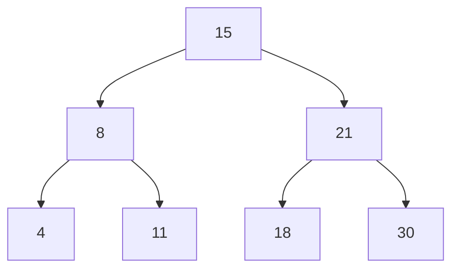

## Basic Explanation

A BST enforces ordering:

- all keys in left subtree are smaller
- all keys in right subtree are larger

This enables search, insert, and delete by repeatedly choosing left or right.

## Big Picture

A BST is a **decision tree for ordered keys**.

At each node, one comparison tells you where to go next:

- smaller -> left
- larger -> right
- equal -> found

That single rule is why balanced BST operations are logarithmic.

## Pros

- Ordered structure supports efficient search and range queries.
- Inorder traversal yields sorted keys directly.
- Insert/search/delete are conceptually simple.

## Cons

- Can degrade to O(n) when skewed.
- Requires balancing variant (AVL/red-black) for robust worst-case guarantees.
- More pointer overhead than array-based sorted containers.

## Use Cases

- Ordered dictionaries/maps
- Range lookups and predecessor/successor queries
- In-memory indexes with frequent mixed reads/writes

## Detailed Explanation

### Complexity

| Operation | Balanced | Skewed |
| --- | --- | --- |
| Search | O(log n) | O(n) |
| Insert | O(log n) | O(n) |
| Delete | O(log n) | O(n) |
| Space | O(n) | O(n) |

## Operations Step-by-Step

### Search

1. Start at root.
2. Compare target with current node key.
3. Move left if smaller, right if larger.
4. Stop at match or null child.

### Insert

1. Follow search path to where key should be.
2. If key already exists, usually skip (set semantics).
3. Attach new node at first null child position on path.

### Delete

Case analysis:

1. Node has no children: remove it directly.
2. Node has one child: splice child into node's position.
3. Node has two children:
   - find inorder successor (smallest key in right subtree)
   - copy successor key into target node
   - delete successor node (which has at most one child)

## How All Pieces Fit Together

- Ordering invariant makes search-like descent possible.
- Insert and delete are "search first, then local pointer rewrite."
- Delete uses inorder successor to preserve sorted invariant after removal.

Balanced shape is essential. If keys arrive in sorted order without rebalancing, tree can degrade to a linked list.

## Edge Cases

1. Inserting sorted input:
   Plain BST becomes skewed, losing logarithmic performance.
2. Duplicate keys:
   Must define policy: reject, overwrite payload, or count frequency.
3. Deleting root repeatedly:
   Root replacement logic (successor/predecessor) must preserve invariant every time.
4. Deleting node with two children:
   Incorrect successor removal can leave broken order relationships.
5. Empty tree operations:
   Search/delete should return safely without panic or null dereference.

## Animated Operation Trace

<div class="operation-anim">
  <p class="operation-anim-title">BST Search for Key 18</p>
  <div class="op-step">1. Start at root (15).</div>
  <div class="op-step">2. 18 > 15, move right.</div>
  <div class="op-step">3. At node 21, 18 < 21, move left.</div>
  <div class="op-step">4. Reach node 18, found target.</div>
  <div class="op-step">5. Stop without exploring unrelated branches.</div>
</div>

### Illustration



## Pseudocode (Search)

```text
node = root
while node != null:
    if key == node.key: return true
    if key < node.key: node = node.left
    else: node = node.right
return false
```

## Full Examples

<div class="code-tabs">
<div class="tab-panel" data-lang="python" markdown="1">

```python
from dataclasses import dataclass
from typing import Optional

@dataclass
class Node:
    key: int
    left: Optional["Node"] = None
    right: Optional["Node"] = None

class BST:
    def __init__(self) -> None:
        self.root: Optional[Node] = None

    def insert(self, key: int) -> None:
        def _insert(node: Optional[Node], key: int) -> Node:
            if node is None:
                return Node(key)
            if key < node.key:
                node.left = _insert(node.left, key)
            elif key > node.key:
                node.right = _insert(node.right, key)
            return node

        self.root = _insert(self.root, key)

    def search(self, key: int) -> bool:
        cur = self.root
        while cur is not None:
            if key == cur.key:
                return True
            cur = cur.left if key < cur.key else cur.right
        return False

bst = BST()
for k in [15, 8, 21, 4, 11, 18, 30]:
    bst.insert(k)
print(bst.search(11), bst.search(7))  # True False
```

</div>
<div class="tab-panel" data-lang="rust" markdown="1">

```rust
#[derive(Debug)]
struct Node {
    key: i32,
    left: Option<Box<Node>>,
    right: Option<Box<Node>>,
}

#[derive(Debug, Default)]
struct Bst {
    root: Option<Box<Node>>,
}

impl Bst {
    fn insert(&mut self, key: i32) {
        fn rec(node: &mut Option<Box<Node>>, key: i32) {
            match node {
                None => {
                    *node = Some(Box::new(Node {
                        key,
                        left: None,
                        right: None,
                    }))
                }
                Some(n) => {
                    if key < n.key {
                        rec(&mut n.left, key);
                    } else if key > n.key {
                        rec(&mut n.right, key);
                    }
                }
            }
        }
        rec(&mut self.root, key);
    }

    fn search(&self, key: i32) -> bool {
        let mut cur = self.root.as_ref();
        while let Some(n) = cur {
            if key == n.key {
                return true;
            }
            cur = if key < n.key { n.left.as_ref() } else { n.right.as_ref() };
        }
        false
    }
}

fn main() {
    let mut bst = Bst::default();
    for k in [15, 8, 21, 4, 11, 18, 30] {
        bst.insert(k);
    }
    println!("{} {}", bst.search(11), bst.search(7)); // true false
}
```

</div>
<div class="tab-panel" data-lang="go" markdown="1">

```go
package main

import "fmt"

type Node struct {
    Key   int
    Left  *Node
    Right *Node
}

type BST struct {
    Root *Node
}

func insert(node *Node, key int) *Node {
    if node == nil {
        return &Node{Key: key}
    }
    if key < node.Key {
        node.Left = insert(node.Left, key)
    } else if key > node.Key {
        node.Right = insert(node.Right, key)
    }
    return node
}

func (b *BST) Insert(key int) {
    b.Root = insert(b.Root, key)
}

func (b *BST) Search(key int) bool {
    cur := b.Root
    for cur != nil {
        if key == cur.Key {
            return true
        }
        if key < cur.Key {
            cur = cur.Left
        } else {
            cur = cur.Right
        }
    }
    return false
}

func main() {
    bst := &BST{}
    for _, k := range []int{15, 8, 21, 4, 11, 18, 30} {
        bst.Insert(k)
    }
    fmt.Println(bst.Search(11), bst.Search(7)) // true false
}
```

</div>
</div>
