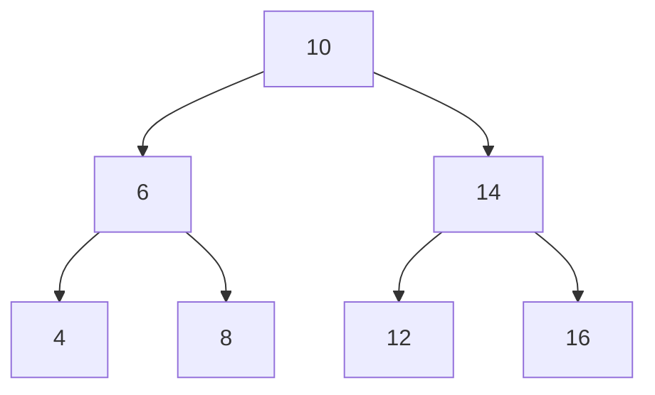

## Basic Explanation

A binary tree node has at most two children: `left` and `right`.

Binary trees are not automatically sorted. They are structural containers used in many algorithms.

## Big Picture

Think of a binary tree as a recursive container:

- each node is a small record (`value`, `left`, `right`)
- each child is itself the root of another binary tree

Because the structure is recursive, tree algorithms are often recursive too.

## Pros

- Natural representation for hierarchical data.
- Recursive divide-and-conquer algorithms map cleanly.
- Foundation for many specialized structures (BST, heap, AVL, red-black).

## Cons

- No automatic ordering unless extra invariant is imposed.
- Pointer-heavy memory layout can hurt cache locality.
- Deep/skewed trees can trigger recursion depth concerns.

## Use Cases

- Expression trees and syntax trees
- File system or organization hierarchies
- Recursive problem decomposition
- Base model for advanced tree-based data structures

## Detailed Explanation

### Complexity (n = number of nodes, h = height)

| Operation | Time | Space |
| --- | --- | --- |
| DFS traversal | O(n) | O(h) recursion stack |
| BFS traversal | O(n) | O(w) queue, where w is max width |
| Search by value (unsorted tree) | O(n) | O(h) |

## Operations Step-by-Step

### DFS Traversal (Recursive)

1. Start at root.
2. Recursively visit left subtree.
3. Recursively visit right subtree.
4. Order of "visit current node" gives preorder/inorder/postorder variants.

### BFS Traversal (Queue)

1. Put root in queue.
2. Pop front node and visit it.
3. Push its left and right children (if present).
4. Repeat until queue empty.

### Search by Value (Unsorted Tree)

1. Compare current node value to target.
2. If equal, stop.
3. Otherwise search left subtree; if not found, search right subtree.
4. If both fail, value is absent.

## How All Pieces Fit Together

- Node shape defines what edges exist (`left`, `right`).
- Traversal strategy defines visiting order.
- Search strategy is built on traversal strategy.

Without additional ordering invariants (like BST), traversal must potentially inspect all nodes in worst case.

## Edge Cases

1. Empty tree:
   Traversals and search should return empty/not-found without errors.
2. Degenerate (linked-list-like) tree:
   Height becomes O(n), making recursive stack and traversal behavior worse.
3. Duplicate values:
   Search-by-value may find first encountered duplicate, not unique identity.
4. Very deep trees:
   Recursive implementations may hit call-stack limits; iterative traversal is safer.
5. Missing child pointers:
   All algorithms must null-check before descending.

## Animated Operation Trace

<div class="operation-anim">
  <p class="operation-anim-title">BFS Layer Traversal</p>
  <div class="op-step">1. Queue starts with root node.</div>
  <div class="op-step">2. Dequeue root, visit it, enqueue its children.</div>
  <div class="op-step">3. Dequeue next layer nodes left to right.</div>
  <div class="op-step">4. Enqueue their children, continue by depth.</div>
  <div class="op-step">5. Stop when queue becomes empty.</div>
</div>

<div class="operation-anim">
  <p class="operation-anim-title">Full Animation: Build + Traverse + Search</p>
  <div class="op-step">1. Insert nodes to form target binary-tree shape.</div>
  <div class="op-step">2. Run DFS traversal to collect structural order.</div>
  <div class="op-step">3. Run BFS traversal to collect level order.</div>
  <div class="op-step">4. Perform value search by exploring both subtrees as needed.</div>
  <div class="op-step">5. Return traversal output and search result.</div>
</div>

<div class="operation-anim">
  <p class="operation-anim-title">Edge-Case Animation: Skewed Tree Recursion Risk</p>
  <div class="op-step">1. Inserts create one-sided chain (height n).</div>
  <div class="op-step">2. Recursive DFS depth grows linearly.</div>
  <div class="op-step">3. Call stack pressure increases on deep inputs.</div>
  <div class="op-step">4. Switch to iterative stack traversal.</div>
  <div class="op-step">5. Preserve correctness while avoiding stack overflow.</div>
</div>

### Illustration



## Full Examples (Inorder Traversal)

<div class="code-tabs">
<div class="tab-panel" data-lang="python" markdown="1">

```python
from dataclasses import dataclass
from typing import Optional

@dataclass
class Node:
    value: int
    left: Optional["Node"] = None
    right: Optional["Node"] = None

def inorder(root: Optional[Node]) -> list[int]:
    if root is None:
        return []
    return inorder(root.left) + [root.value] + inorder(root.right)

root = Node(10,
    left=Node(6, Node(4), Node(8)),
    right=Node(14, Node(12), Node(16)),
)

print(inorder(root))  # [4, 6, 8, 10, 12, 14, 16]
```

</div>
<div class="tab-panel" data-lang="rust" markdown="1">

```rust
#[derive(Debug)]
struct Node {
    value: i32,
    left: Option<Box<Node>>,
    right: Option<Box<Node>>,
}

impl Node {
    fn new(value: i32) -> Self {
        Self {
            value,
            left: None,
            right: None,
        }
    }
}

fn inorder(root: &Option<Box<Node>>, out: &mut Vec<i32>) {
    if let Some(node) = root {
        inorder(&node.left, out);
        out.push(node.value);
        inorder(&node.right, out);
    }
}

fn main() {
    let root = Some(Box::new(Node {
        value: 10,
        left: Some(Box::new(Node {
            value: 6,
            left: Some(Box::new(Node::new(4))),
            right: Some(Box::new(Node::new(8))),
        })),
        right: Some(Box::new(Node {
            value: 14,
            left: Some(Box::new(Node::new(12))),
            right: Some(Box::new(Node::new(16))),
        })),
    }));

    let mut out = Vec::new();
    inorder(&root, &mut out);
    println!("{:?}", out); // [4, 6, 8, 10, 12, 14, 16]
}
```

</div>
<div class="tab-panel" data-lang="go" markdown="1">

```go
package main

import "fmt"

type Node struct {
    Value int
    Left  *Node
    Right *Node
}

func inorder(root *Node, out *[]int) {
    if root == nil {
        return
    }
    inorder(root.Left, out)
    *out = append(*out, root.Value)
    inorder(root.Right, out)
}

func main() {
    root := &Node{10,
        &Node{6, &Node{4, nil, nil}, &Node{8, nil, nil}},
        &Node{14, &Node{12, nil, nil}, &Node{16, nil, nil}},
    }

    out := []int{}
    inorder(root, &out)
    fmt.Println(out) // [4 6 8 10 12 14 16]
}
```

</div>
</div>
