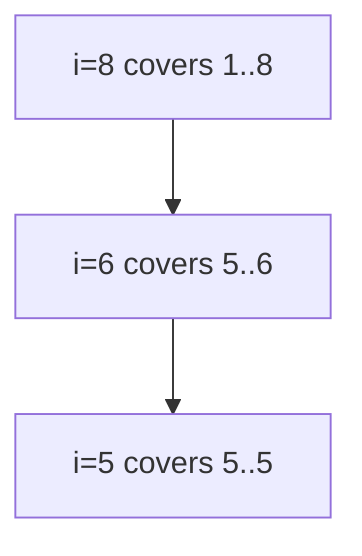

## Basic Explanation

Fenwick tree (Binary Indexed Tree, BIT) stores partial prefix sums in a compact 1-indexed array.

It is designed for workloads with:

- point updates (`arr[i] += delta` or set via delta)
- prefix sum queries (`sum(arr[0..i])`)

Range sums come from two prefixes:

`sum(l..r) = prefix(r) - prefix(l-1)`

## Problem It Solves (Compared to Brute Force)

Brute force:

- update is `O(1)`
- prefix/range query is `O(n)`

Prefix sums array:

- query is `O(1)`
- update is `O(n)` (must adjust many prefix entries)

Fenwick tree balances both:

- update `O(log n)`
- prefix/range query `O(log n)`
- space `O(n)`

## Big Picture

Fenwick tree is usually the first choice for mutable range-sum style tasks.

Choose Fenwick when:

- operation is sum-like and invertible
- you need frequent updates and frequent range/prefix queries
- you want a compact iterative structure

Choose segment tree when:

- you need more general range aggregates
- you need richer range updates (lazy propagation patterns)

## Pros

- Very compact (`O(n)` storage).
- Easy iterative implementation.
- Excellent constants for prefix/range sum workloads.

## Cons

- Less general than segment tree.
- Indexing/bit tricks are non-obvious at first.
- Not ideal for complex non-invertible range aggregates.

## Mental Model: What `bit[i]` Actually Stores

For internal 1-indexed array, Fenwick invariant is:

`bit[i]` stores sum of range `[i - lowbit(i) + 1, i]`

where:

- `lowbit(i) = i & -i`
- `lowbit(i)` is value of least significant set bit in `i`

This tells interval length covered by node `i`.

### `lowbit` Table (n = 8)

| i (1-indexed) | binary(i) | lowbit(i) | interval covered by `bit[i]` |
| --- | --- | --- | --- |
| 1 | `0001` | 1 | `[1,1]` |
| 2 | `0010` | 2 | `[1,2]` |
| 3 | `0011` | 1 | `[3,3]` |
| 4 | `0100` | 4 | `[1,4]` |
| 5 | `0101` | 1 | `[5,5]` |
| 6 | `0110` | 2 | `[5,6]` |
| 7 | `0111` | 1 | `[7,7]` |
| 8 | `1000` | 8 | `[1,8]` |

That is why BIT is powerful:

- update climbs through nodes whose ranges include the updated index
- query descends through nodes that partition a prefix

## Detailed Explanation

### Complexity

| Operation | Time | Space |
| --- | --- | --- |
| Build (naive repeated add) | O(n log n) | O(n) |
| Build (optimized) | O(n) | O(n) |
| Point update | O(log n) | O(1) |
| Prefix sum | O(log n) | O(1) |
| Range sum | O(log n) | O(1) |

### Why `O(log n)`

Both loops move by `lowbit(i)`.

- Query loop: `i -= lowbit(i)` clears lowest set bit each step.
- Update loop: `i += lowbit(i)` jumps to next ancestor coverage.

Number of steps is bounded by number of bits in index size -> `O(log n)`.

## Operations Step-by-Step (Detailed)

### Point Update `add(idx, delta)` (0-index external API)

1. Convert `idx` to internal `i = idx + 1`.
2. Add `delta` to `bit[i]`.
3. Jump to next impacted node: `i += lowbit(i)`.
4. Repeat while `i <= n`.

Why this works:

each visited node is exactly a node whose stored interval includes that element.

### Prefix Query `prefix_sum(idx)`

1. Convert `idx` to `i = idx + 1`.
2. Add `bit[i]` to running sum.
3. Move to previous contributing block: `i -= lowbit(i)`.
4. Repeat until `i == 0`.

Why this works:

the visited intervals are disjoint and exactly cover `[1..idx+1]`.

### Range Query `[l, r]`

`range_sum(l, r) = prefix_sum(r) - prefix_sum(l - 1)`

### Set Update vs Add Update

Fenwick naturally supports **add delta**.
To support **set value**:

1. store current array value
2. compute `delta = new_value - old_value`
3. call `add(idx, delta)`

## Worked Trace: Prefix Sum Example

Array (0-indexed):

`arr = [2, 1, 5, 3, 4, 7, 6, 8]`

Compute `prefix_sum(5)` (sum indices `0..5`, expected `22`):

Start `i = 6` (because internal index is `idx+1`).

| Step | i | lowbit(i) | add `bit[i]` interval | Running Sum | next i |
| --- | --- | --- | --- | --- | --- |
| 1 | 6 | 2 | `[5,6]` | `11` | `4` |
| 2 | 4 | 4 | `[1,4]` | `22` | `0` |

Stop at `i=0`. Result `22` is correct.

## Worked Trace: Point Update Example

Set `arr[3]` from `3` to `10`.

- delta = `+7`
- start internal `i = 4`

Update path:

| Step | i | lowbit(i) | Action | next i |
| --- | --- | --- | --- | --- |
| 1 | 4 | 4 | `bit[4] += 7` | 8 |
| 2 | 8 | 8 | `bit[8] += 7` | 16 (stop) |

Only those nodes are touched because only those stored intervals include index `4` (1-indexed).

## Build Methods

### Method 1: Repeated `add` (simple, O(n log n))

For each index `i`, call `add(i, arr[i])`.
Easy and robust.

### Method 2: Linear Build (O(n))

For 1-indexed `bit` initialized with raw values:

```text
for i in 1..n:
  j = i + lowbit(i)
  if j <= n:
    bit[j] += bit[i]
```

Use this if you need fastest initialization for large `n`.

## Edge Cases

1. Off-by-one bugs:
   Be explicit about 0-index external API vs internal 1-index storage.
2. Invalid ranges:
   Validate `0 <= l <= r < n`.
3. Overflow:
   Use wider integer type for large totals.
4. Wrong update semantics:
   Fenwick update is delta-based; set-value update requires computing delta first.
5. Empty input:
   decide API behavior early (`query` return 0 or panic/raise).
6. Signedness bugs in lowbit:
   in systems languages, use correct unsigned/signed operations carefully.

## Animated Operation Trace

<div class="operation-anim">
  <p class="operation-anim-title">Fenwick Point Update</p>
  <div class="op-step">1. Start at updated index (1-indexed).</div>
  <div class="op-step">2. Add delta to current node.</div>
  <div class="op-step">3. Jump upward by lowbit.</div>
  <div class="op-step">4. Repeat until index exceeds n.</div>
  <div class="op-step">5. All covering prefixes are updated.</div>
</div>

<div class="operation-anim">
  <p class="operation-anim-title">Full Animation: Prefix and Range Sum</p>
  <div class="op-step">1. Prefix query accumulates bit nodes by subtracting lowbit.</div>
  <div class="op-step">2. Path quickly reaches zero in logarithmic steps.</div>
  <div class="op-step">3. Compute left prefix and right prefix.</div>
  <div class="op-step">4. Subtract to get closed interval range sum.</div>
  <div class="op-step">5. Return result with no recursion.</div>
</div>

### Diagram



Example prefix path for internal index `6`:

`6 -> 4 -> 0`

## Pseudocode

```text
add(i, delta):
  i = i + 1
  while i <= n:
    bit[i] += delta
    i += i & -i

prefix_sum(i):
  i = i + 1
  s = 0
  while i > 0:
    s += bit[i]
    i -= i & -i
  return s
```

## Full Complete Examples

<div class="code-tabs">
<div class="tab-panel" data-lang="python" markdown="1">

```python
class Fenwick:
    def __init__(self, nums: list[int]) -> None:
        self.n = len(nums)
        self.bit = [0] * (self.n + 1)
        self.arr = nums[:]
        for i, v in enumerate(nums):
            self.add(i, v)

    def add(self, idx: int, delta: int) -> None:
        if not (0 <= idx < self.n):
            raise IndexError("idx out of range")
        i = idx + 1
        while i <= self.n:
            self.bit[i] += delta
            i += i & -i

    def set(self, idx: int, value: int) -> None:
        delta = value - self.arr[idx]
        self.arr[idx] = value
        self.add(idx, delta)

    def prefix_sum(self, idx: int) -> int:
        if idx < 0:
            return 0
        if idx >= self.n:
            idx = self.n - 1
        i = idx + 1
        s = 0
        while i > 0:
            s += self.bit[i]
            i -= i & -i
        return s

    def range_sum(self, l: int, r: int) -> int:
        if not (0 <= l <= r < self.n):
            raise IndexError("invalid range")
        return self.prefix_sum(r) - self.prefix_sum(l - 1)


arr = [2, 1, 5, 3, 4, 7, 6, 8]
fw = Fenwick(arr)
print(fw.range_sum(2, 5))  # 19
fw.set(3, 10)              # arr[3] 3 -> 10
print(fw.range_sum(2, 5))  # 26
```

</div>
<div class="tab-panel" data-lang="rust" markdown="1">

```rust
struct Fenwick {
    n: usize,
    bit: Vec<i64>,
    arr: Vec<i64>,
}

impl Fenwick {
    fn lowbit(i: usize) -> usize {
        i & i.wrapping_neg()
    }

    fn new(nums: &[i64]) -> Self {
        let n = nums.len();
        let mut fw = Self {
            n,
            bit: vec![0; n + 1],
            arr: nums.to_vec(),
        };
        for (i, &v) in nums.iter().enumerate() {
            fw.add(i, v);
        }
        fw
    }

    fn add(&mut self, idx: usize, delta: i64) {
        assert!(idx < self.n, "idx out of range");
        let mut i = idx + 1;
        while i <= self.n {
            self.bit[i] += delta;
            i += Self::lowbit(i);
        }
    }

    fn set(&mut self, idx: usize, value: i64) {
        let delta = value - self.arr[idx];
        self.arr[idx] = value;
        self.add(idx, delta);
    }

    fn prefix_sum(&self, idx: isize) -> i64 {
        if idx < 0 {
            return 0;
        }
        let mut i = usize::min(idx as usize + 1, self.n);
        let mut s = 0;
        while i > 0 {
            s += self.bit[i];
            i -= Self::lowbit(i);
        }
        s
    }

    fn range_sum(&self, l: usize, r: usize) -> i64 {
        assert!(l <= r && r < self.n, "invalid range");
        self.prefix_sum(r as isize) - self.prefix_sum(l as isize - 1)
    }
}

fn main() {
    let arr = vec![2, 1, 5, 3, 4, 7, 6, 8];
    let mut fw = Fenwick::new(&arr);
    println!("{}", fw.range_sum(2, 5)); // 19
    fw.set(3, 10);
    println!("{}", fw.range_sum(2, 5)); // 26
}
```

</div>
<div class="tab-panel" data-lang="go" markdown="1">

```go
package main

import "fmt"

type Fenwick struct {
    n   int
    bit []int64
    arr []int64
}

func NewFenwick(nums []int64) *Fenwick {
    fw := &Fenwick{n: len(nums), bit: make([]int64, len(nums)+1), arr: append([]int64(nil), nums...)}
    for i, v := range nums {
        fw.Add(i, v)
    }
    return fw
}

func (fw *Fenwick) Add(idx int, delta int64) {
    if idx < 0 || idx >= fw.n {
        panic("idx out of range")
    }
    for i := idx + 1; i <= fw.n; i += i & -i {
        fw.bit[i] += delta
    }
}

func (fw *Fenwick) Set(idx int, value int64) {
    delta := value - fw.arr[idx]
    fw.arr[idx] = value
    fw.Add(idx, delta)
}

func (fw *Fenwick) PrefixSum(idx int) int64 {
    if idx < 0 {
        return 0
    }
    if idx >= fw.n {
        idx = fw.n - 1
    }
    sum := int64(0)
    for i := idx + 1; i > 0; i -= i & -i {
        sum += fw.bit[i]
    }
    return sum
}

func (fw *Fenwick) RangeSum(l, r int) int64 {
    if l < 0 || r >= fw.n || l > r {
        panic("invalid range")
    }
    return fw.PrefixSum(r) - fw.PrefixSum(l-1)
}

func main() {
    arr := []int64{2, 1, 5, 3, 4, 7, 6, 8}
    fw := NewFenwick(arr)
    fmt.Println(fw.RangeSum(2, 5)) // 19
    fw.Set(3, 10)
    fmt.Println(fw.RangeSum(2, 5)) // 26
}
```

</div>
</div>
