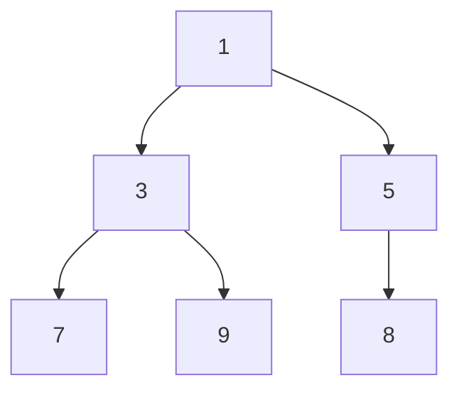

## Basic Explanation

A heap is usually stored in an array and keeps the heap property:

- Min-heap: parent <= children
- Max-heap: parent >= children

Heaps are efficient priority queues.

## Big Picture

Heap is a **shape + order** structure:

- shape: complete binary tree (compact array layout)
- order: parent dominates children (min or max)

Because it is complete, array indices can represent tree links:

- left child of `i` -> `2*i + 1`
- right child of `i` -> `2*i + 2`
- parent of `i` -> `(i - 1) // 2`

## Pros

- Fast repeated min/max extraction.
- Compact array representation (no explicit child pointers needed).
- Excellent fit for priority queues and scheduling.

## Cons

- No efficient search for arbitrary key (typically O(n)).
- Inorder traversal is not sorted order.
- Decrease-key/update-priority can be awkward in basic APIs.

## Use Cases

- Task schedulers and event loops
- Dijkstra/A* priority queue core
- Streaming top-k / running minimum-maximum tasks
- Heap sort and order-statistics helpers

## Detailed Explanation

### Complexity

| Operation | Time | Space |
| --- | --- | --- |
| Peek min/max | O(1) | O(1) |
| Push | O(log n) | O(1) |
| Pop min/max | O(log n) | O(1) |
| Build heap from array | O(n) | O(1) extra |

## Operations Step-by-Step

### Push (Insert)

1. Append new value at array end.
2. "Bubble up" while heap property is violated with parent.
3. Swap with parent each step until valid.

### Pop (Remove Root)

1. Save root value (answer).
2. Move last element to root.
3. Remove last element.
4. "Bubble down" by swapping with smaller child (min-heap) until valid.

### Heapify (Build from Array)

1. Treat array as complete tree.
2. Start from last non-leaf node and bubble-down each node.
3. Move backward to root.

This bottom-up repair is why build-heap is O(n), not O(n log n).

## How All Pieces Fit Together

- Complete-tree shape gives compact memory and parent/child math.
- Heap-order property guarantees root is global min/max.
- Bubble-up and bubble-down are local repairs that re-establish global property.

As a result, heaps are ideal for repeatedly extracting highest priority items.

## Edge Cases

1. Empty heap pop/peek:
   APIs should return explicit empty signal instead of crashing.
2. Equal priorities:
   If tie order matters, include secondary monotonic key for stability.
3. Comparator mismatch:
   Wrong `Less`/ordering direction silently flips min-heap to max-heap (or vice versa).
4. Overflow in derived priorities:
   Combining fields into one numeric priority can overflow without bounds checks.
5. Mutable items after insertion:
   Changing key in place without reheapify breaks heap property.

## Animated Operation Trace

<div class="operation-anim">
  <p class="operation-anim-title">Min-Heap Push(4)</p>
  <div class="op-step">1. Append 4 at end of array.</div>
  <div class="op-step">2. Compare with parent value.</div>
  <div class="op-step">3. If 4 is smaller, swap upward.</div>
  <div class="op-step">4. Repeat until parent is smaller or root reached.</div>
  <div class="op-step">5. Heap property restored globally.</div>
</div>

### Illustration



## Full Examples

<div class="code-tabs">
<div class="tab-panel" data-lang="python" markdown="1">

```python
import heapq

nums = [7, 3, 9, 1, 5]
heapq.heapify(nums)  # min-heap in place

heapq.heappush(nums, 4)
smallest = heapq.heappop(nums)
print(smallest)  # 1
print(nums)      # heap order, not globally sorted

# Max-heap pattern in Python: push negatives.
max_heap = []
for x in [7, 3, 9]:
    heapq.heappush(max_heap, -x)
print(-heapq.heappop(max_heap))  # 9
```

</div>
<div class="tab-panel" data-lang="rust" markdown="1">

```rust
use std::cmp::Reverse;
use std::collections::BinaryHeap;

fn main() {
    // Max-heap by default.
    let mut max_h = BinaryHeap::new();
    max_h.push(7);
    max_h.push(3);
    max_h.push(9);
    println!("{:?}", max_h.pop()); // Some(9)

    // Min-heap using Reverse wrapper.
    let mut min_h: BinaryHeap<Reverse<i32>> = BinaryHeap::new();
    for x in [7, 3, 9, 1, 5] {
        min_h.push(Reverse(x));
    }
    min_h.push(Reverse(4));
    println!("{:?}", min_h.pop().map(|Reverse(v)| v)); // Some(1)
}
```

</div>
<div class="tab-panel" data-lang="go" markdown="1">

```go
package main

import (
    "container/heap"
    "fmt"
)

type IntMinHeap []int

func (h IntMinHeap) Len() int           { return len(h) }
func (h IntMinHeap) Less(i, j int) bool { return h[i] < h[j] }
func (h IntMinHeap) Swap(i, j int)      { h[i], h[j] = h[j], h[i] }
func (h *IntMinHeap) Push(x any)        { *h = append(*h, x.(int)) }
func (h *IntMinHeap) Pop() any {
    old := *h
    n := len(old)
    x := old[n-1]
    *h = old[:n-1]
    return x
}

func main() {
    h := &IntMinHeap{7, 3, 9, 1, 5}
    heap.Init(h)
    heap.Push(h, 4)
    smallest := heap.Pop(h).(int)
    fmt.Println(smallest) // 1
}
```

</div>
</div>

## Priority Queue Notes

- Use tuples/structs `(priority, item)` or custom comparator wrappers.
- For stable tie-breaking, include a monotonic sequence number.
