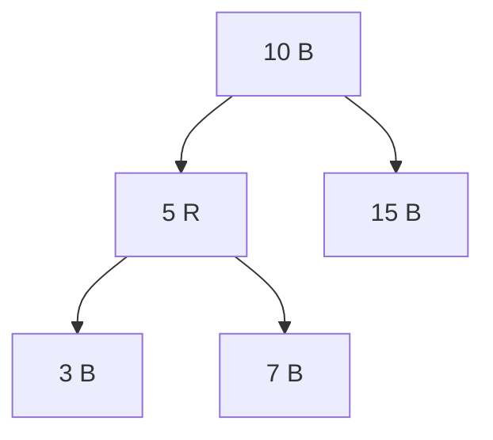

## Basic Explanation

A red-black tree is a binary search tree with node colors (`red` or `black`) and balancing rules.

Key rules:

- Root is black.
- No red node has a red child.
- Every root-to-leaf path has the same number of black nodes.

These rules bound height to O(log n).

## Big Picture

Red-black trees are balanced BSTs using **color constraints** instead of explicit height factors.

- fewer strict updates than AVL on average
- guaranteed logarithmic height
- widely used in standard libraries and kernels

## Pros

- Guaranteed O(log n) operations with moderate balancing cost.
- Typically fewer rotations than AVL during updates.
- Proven, industry-standard balancing strategy.

## Cons

- Invariants are subtle and easy to break in custom implementations.
- Delete fix-up logic is significantly complex.
- Harder for beginners to debug than AVL or plain BST.

## Use Cases

- Ordered maps/sets in language runtimes and standard libraries
- Kernel and systems data structures requiring stable performance
- General-purpose balanced BST when update/read mix is balanced

## Detailed Explanation

### Complexity

| Operation | Time | Space |
| --- | --- | --- |
| Search | O(log n) | O(1) |
| Insert | O(log n) | O(log n) recursion stack |
| Delete | O(log n) | O(log n) recursion stack |

## Operations Step-by-Step

### Search

Exactly BST search:

1. compare key at current node
2. move left for smaller, right for larger
3. stop on match or null

### Insert (LLRB-style in this page)

1. Insert new key as red leaf using BST logic.
2. On unwind, fix right-leaning red links (rotate left).
3. Fix consecutive left red links (rotate right).
4. Split temporary 4-node representation (color flip).
5. Force root to black.

### Delete (High-Level)

1. Find node using BST descent.
2. Transform path so deletions do not violate black-height constraints.
3. Remove node.
4. Restore invariants with recoloring and rotations on way up.

Deletion logic is the most subtle operation in red-black trees.

## How All Pieces Fit Together

- BST invariant gives order.
- Colors encode balancing information compactly.
- Rotations change local structure.
- Recoloring changes balance metadata without moving keys.

Together, they preserve both order and near-balanced height.

## Edge Cases

1. Red-red violations after insert:
   Parent-child both red must be fixed by rotation/recoloring.
2. Root color drift:
   Root must always be reset to black after operations.
3. Delete black node:
   Can change black-height and requires careful fix-up propagation.
4. Consecutive color flips:
   Local fix at one level can create violation at ancestor level.
5. Duplicate-key policy:
   Insert logic should clearly define replace/ignore behavior to avoid inconsistent trees.

## Animated Operation Trace

<div class="operation-anim">
  <p class="operation-anim-title">Red-Black Insert Fix-up</p>
  <div class="op-step">1. Insert new key as red leaf.</div>
  <div class="op-step">2. Detect right-leaning red link, rotate left.</div>
  <div class="op-step">3. Detect two reds in a row on left, rotate right.</div>
  <div class="op-step">4. If both children red, flip colors.</div>
  <div class="op-step">5. Recolor root black to finalize invariants.</div>
</div>

<div class="operation-anim">
  <p class="operation-anim-title">Full Animation: Ordered Map Operation Cycle</p>
  <div class="op-step">1. Insert key using BST comparison path.</div>
  <div class="op-step">2. Apply local rotations and color flips.</div>
  <div class="op-step">3. Search queries follow logarithmic-height path.</div>
  <div class="op-step">4. Delete performs structured fix-ups to preserve black height.</div>
  <div class="op-step">5. Tree remains balanced for future operations.</div>
</div>

<div class="operation-anim">
  <p class="operation-anim-title">Edge-Case Animation: Black-Height Violation on Delete</p>
  <div class="op-step">1. Delete black node from one branch.</div>
  <div class="op-step">2. Path loses one black count compared to sibling path.</div>
  <div class="op-step">3. Apply recolor/rotation fix-up while moving imbalance upward.</div>
  <div class="op-step">4. Resolve at ancestor or root.</div>
  <div class="op-step">5. All root-to-leaf paths regain equal black height.</div>
</div>

### Illustration



## Pseudocode (LLRB-style insert)

```text
insert recursively like BST
if right child is red and left child is black: rotate left
if left child is red and left-left grandchild is red: rotate right
if both children are red: flip colors
set root black
```

## Full Examples

<div class="code-tabs">
<div class="tab-panel" data-lang="python" markdown="1">

```python
from __future__ import annotations
from dataclasses import dataclass
from typing import Optional

RED = True
BLACK = False

@dataclass
class Node:
    key: int
    color: bool = RED
    left: Optional["Node"] = None
    right: Optional["Node"] = None

class RedBlackTree:
    def __init__(self) -> None:
        self.root: Optional[Node] = None

    def _is_red(self, n: Optional[Node]) -> bool:
        return n is not None and n.color == RED

    def _rotate_left(self, h: Node) -> Node:
        x = h.right
        assert x is not None
        h.right = x.left
        x.left = h
        x.color = h.color
        h.color = RED
        return x

    def _rotate_right(self, h: Node) -> Node:
        x = h.left
        assert x is not None
        h.left = x.right
        x.right = h
        x.color = h.color
        h.color = RED
        return x

    def _flip_colors(self, h: Node) -> None:
        h.color = RED if h.color == BLACK else BLACK
        if h.left:
            h.left.color = RED if h.left.color == BLACK else BLACK
        if h.right:
            h.right.color = RED if h.right.color == BLACK else BLACK

    def _insert(self, h: Optional[Node], key: int) -> Node:
        if h is None:
            return Node(key=key, color=RED)

        if key < h.key:
            h.left = self._insert(h.left, key)
        elif key > h.key:
            h.right = self._insert(h.right, key)

        if self._is_red(h.right) and not self._is_red(h.left):
            h = self._rotate_left(h)
        if self._is_red(h.left) and self._is_red(h.left.left if h.left else None):
            h = self._rotate_right(h)
        if self._is_red(h.left) and self._is_red(h.right):
            self._flip_colors(h)

        return h

    def insert(self, key: int) -> None:
        self.root = self._insert(self.root, key)
        if self.root:
            self.root.color = BLACK

    def contains(self, key: int) -> bool:
        cur = self.root
        while cur is not None:
            if key == cur.key:
                return True
            cur = cur.left if key < cur.key else cur.right
        return False

rb = RedBlackTree()
for k in [10, 5, 15, 3, 7, 12, 18]:
    rb.insert(k)
print(rb.contains(7), rb.contains(9))  # True False
```

</div>
<div class="tab-panel" data-lang="rust" markdown="1">

```rust
#[derive(Clone, Copy, Debug, PartialEq, Eq)]
enum Color {
    Red,
    Black,
}

type Link = Option<Box<Node>>;

#[derive(Debug)]
struct Node {
    key: i32,
    color: Color,
    left: Link,
    right: Link,
}

impl Node {
    fn new(key: i32, color: Color) -> Self {
        Self {
            key,
            color,
            left: None,
            right: None,
        }
    }
}

#[derive(Debug, Default)]
struct RedBlackTree {
    root: Link,
}

impl RedBlackTree {
    fn is_red(link: &Link) -> bool {
        matches!(link, Some(n) if n.color == Color::Red)
    }

    fn toggle(c: Color) -> Color {
        match c {
            Color::Red => Color::Black,
            Color::Black => Color::Red,
        }
    }

    fn rotate_left(mut h: Box<Node>) -> Box<Node> {
        let h_color = h.color;
        let mut x = h.right.take().expect("rotate_left requires right child");
        h.right = x.left.take();
        x.left = Some(h);
        x.color = h_color;
        if let Some(left) = x.left.as_mut() {
            left.color = Color::Red;
        }
        x
    }

    fn rotate_right(mut h: Box<Node>) -> Box<Node> {
        let h_color = h.color;
        let mut x = h.left.take().expect("rotate_right requires left child");
        h.left = x.right.take();
        x.right = Some(h);
        x.color = h_color;
        if let Some(right) = x.right.as_mut() {
            right.color = Color::Red;
        }
        x
    }

    fn flip_colors(h: &mut Box<Node>) {
        h.color = Self::toggle(h.color);
        if let Some(left) = h.left.as_mut() {
            left.color = Self::toggle(left.color);
        }
        if let Some(right) = h.right.as_mut() {
            right.color = Self::toggle(right.color);
        }
    }

    fn insert_rec(h: Link, key: i32) -> Box<Node> {
        let mut node = match h {
            None => return Box::new(Node::new(key, Color::Red)),
            Some(n) => n,
        };

        if key < node.key {
            node.left = Some(Self::insert_rec(node.left.take(), key));
        } else if key > node.key {
            node.right = Some(Self::insert_rec(node.right.take(), key));
        }

        if Self::is_red(&node.right) && !Self::is_red(&node.left) {
            node = Self::rotate_left(node);
        }

        let left_left_red = if let Some(left) = node.left.as_ref() {
            Self::is_red(&left.left)
        } else {
            false
        };
        if Self::is_red(&node.left) && left_left_red {
            node = Self::rotate_right(node);
        }

        if Self::is_red(&node.left) && Self::is_red(&node.right) {
            Self::flip_colors(&mut node);
        }

        node
    }

    fn insert(&mut self, key: i32) {
        self.root = Some(Self::insert_rec(self.root.take(), key));
        if let Some(root) = self.root.as_mut() {
            root.color = Color::Black;
        }
    }

    fn contains(&self, key: i32) -> bool {
        let mut cur = self.root.as_ref();
        while let Some(n) = cur {
            if key == n.key {
                return true;
            }
            cur = if key < n.key { n.left.as_ref() } else { n.right.as_ref() };
        }
        false
    }
}

fn main() {
    let mut rb = RedBlackTree::default();
    for k in [10, 5, 15, 3, 7, 12, 18] {
        rb.insert(k);
    }
    println!("{} {}", rb.contains(7), rb.contains(9)); // true false
}
```

</div>
<div class="tab-panel" data-lang="go" markdown="1">

```go
package main

import "fmt"

const (
    red   = true
    black = false
)

type Node struct {
    key         int
    color       bool
    left, right *Node
}

type RedBlackTree struct {
    root *Node
}

func isRed(n *Node) bool {
    return n != nil && n.color == red
}

func rotateLeft(h *Node) *Node {
    x := h.right
    h.right = x.left
    x.left = h
    x.color = h.color
    h.color = red
    return x
}

func rotateRight(h *Node) *Node {
    x := h.left
    h.left = x.right
    x.right = h
    x.color = h.color
    h.color = red
    return x
}

func flipColors(h *Node) {
    h.color = !h.color
    if h.left != nil {
        h.left.color = !h.left.color
    }
    if h.right != nil {
        h.right.color = !h.right.color
    }
}

func insertRec(h *Node, key int) *Node {
    if h == nil {
        return &Node{key: key, color: red}
    }

    if key < h.key {
        h.left = insertRec(h.left, key)
    } else if key > h.key {
        h.right = insertRec(h.right, key)
    }

    if isRed(h.right) && !isRed(h.left) {
        h = rotateLeft(h)
    }
    if isRed(h.left) && isRed(h.left.left) {
        h = rotateRight(h)
    }
    if isRed(h.left) && isRed(h.right) {
        flipColors(h)
    }

    return h
}

func (t *RedBlackTree) Insert(key int) {
    t.root = insertRec(t.root, key)
    if t.root != nil {
        t.root.color = black
    }
}

func (t *RedBlackTree) Contains(key int) bool {
    cur := t.root
    for cur != nil {
        if key == cur.key {
            return true
        }
        if key < cur.key {
            cur = cur.left
        } else {
            cur = cur.right
        }
    }
    return false
}

func main() {
    rb := &RedBlackTree{}
    for _, k := range []int{10, 5, 15, 3, 7, 12, 18} {
        rb.Insert(k)
    }
    fmt.Println(rb.Contains(7), rb.Contains(9)) // true false
}
```

</div>
</div>
