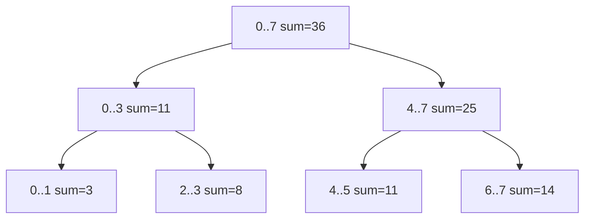

## Basic Explanation

A segment tree is a binary tree built over array index ranges.

Each node stores two things:

- an interval `[l, r]`
- the aggregate value for that interval (sum/min/max/gcd/xor/etc.)

So instead of recomputing a query from scratch every time, you reuse precomputed interval answers.

If you are a beginner, think of it like this:

- leaves store single elements
- parents store merged answers from children
- root stores answer for the full array

## Problem It Solves (Compared to Brute Force)

Suppose you keep an array and run mixed operations:

- query sum in `[L, R]`
- update one index `arr[i] = new_value`

Brute-force approach:

- query scans `L..R` each time -> `O(n)` worst-case
- update is `O(1)`

Prefix sums approach:

- query becomes `O(1)`
- update becomes `O(n)` because many prefix values must change

Segment tree balances both:

- query `O(log n)`
- point update `O(log n)`
- build `O(n)`

## Big Picture

Segment tree is a general-purpose **mutable interval index**.

Use it when you need:

- many queries
- many updates
- consistent fast worst-case bounds for both

If data is static (no updates), prefix sums are simpler.

If you only need prefix/range sums with point updates and want simpler code/constants, Fenwick tree can be lighter.

## Mental Model: "Every Node Owns a Range"

Take:

`arr = [2, 1, 5, 3, 4, 7, 6, 8]`

Root node owns `[0, 7]` and stores `36`.

It splits into:

- left child `[0, 3]` storing `11`
- right child `[4, 7]` storing `25`

Those split again until leaves like `[3, 3]` storing `3`.

You can picture it as recursively answering:

- "what is the answer for the left half?"
- "what is the answer for the right half?"
- "merge those two"

## Pros

- Works for many associative operations (`sum`, `min`, `max`, `gcd`, `xor`).
- Point update and range query are both `O(log n)`.
- Extends to lazy propagation for range updates.
- Deterministic worst-case performance.

## Cons

- More memory than plain array or Fenwick tree.
- More code and more boundary conditions.
- Constant factors can be larger than simpler structures.

## Use Cases

- mutable range sum/min/max dashboards
- online query engines where values are edited frequently
- competitive programming "range query + update" tasks
- core primitive under lazy propagation and interval-update systems

## Core Requirement: Merge Must Be Associative

Segment tree correctness depends on merge associativity:

`merge(a, merge(b, c)) == merge(merge(a, b), c)`

Examples:

| Query Type | Merge Function | Identity (no overlap return) |
| --- | --- | --- |
| sum | `a + b` | `0` |
| min | `min(a, b)` | `+infinity` |
| max | `max(a, b)` | `-infinity` |
| xor | `a ^ b` | `0` |
| gcd | `gcd(a, b)` | `0` (since `gcd(x,0)=x`) |

If identity is wrong, partial-overlap queries return incorrect answers.

## Complexity

| Operation | Time | Space |
| --- | --- | --- |
| Build | O(n) | O(n) tree |
| Point update | O(log n) | O(log n) recursion stack |
| Range query | O(log n) | O(log n) recursion stack |
| Range update (lazy propagation) | O(log n) amortized | O(n) + lazy tags |

### Why Build Is `O(n)` (Not `O(n log n)`)

There are `n` leaves and fewer than `n` internal nodes in the binary decomposition.
Each node is computed once.
Total work is proportional to number of nodes -> `O(n)`.

### Why Query/Update Are `O(log n)`

Tree height is `O(log n)`.

- update walks one root-to-leaf path, then recomputes along that same path
- query only descends into overlapping branches

For range queries, at each depth only a small number of nodes can be partially overlapping.
So total visited nodes stays proportional to tree height.

## Node Layout In Array Form

Most implementations store tree in an array of size about `4*n`.

- root at index `1`
- left child at `2*i`
- right child at `2*i + 1`

Why `4*n`?

- easiest safe upper bound for recursive implementation
- avoids complicated exact sizing for non-power-of-two `n`
- memory is still linear in `n`

## Detailed Explanation

Segment trees recursively split ranges and store merged results at internal nodes, so each query/update touches only `O(log n)` nodes instead of scanning full ranges.

## Operations Step-by-Step (Detailed)

### Build

1. Start at root representing `[0, n-1]`.
2. If `l == r`, this is a leaf; copy `arr[l]`.
3. Otherwise split at `mid = (l + r) // 2`.
4. Recursively build left `[l, mid]` and right `[mid+1, r]`.
5. Merge children into parent.

### Range Query `[ql, qr]`

For current node interval `[l, r]`, exactly one case applies:

1. **No overlap** (`r < ql` or `qr < l`):
   return identity.
2. **Full overlap** (`ql <= l` and `r <= qr`):
   return precomputed node value.
3. **Partial overlap**:
   query both children and merge their results.

That overlap triage is the core idea.

### Point Update `idx = new_value`

1. Descend to the unique leaf whose interval is `[idx, idx]`.
2. Replace leaf value.
3. While returning from recursion, recompute each ancestor by merging children.

Only one branch is followed downward, so this is logarithmic.

## Worked Trace: Query `[2, 5]` On Example Array

For `arr = [2,1,5,3,4,7,6,8]`, query `[2,5]`:

| Node Interval | Overlap Type | Contribution |
| --- | --- | --- |
| `[0,7]` | partial | split |
| `[0,3]` | partial | split |
| `[0,1]` | no overlap | `0` |
| `[2,3]` | full overlap | `8` |
| `[4,7]` | partial | split |
| `[4,5]` | full overlap | `11` |
| `[6,7]` | no overlap | `0` |

Final merge: `8 + 11 = 19`.

## Worked Trace: Update `arr[3] = 10`

Original `arr[3] = 3`, new value `10`.

Path visited:

`[0,7] -> [0,3] -> [2,3] -> [3,3]`

Recompute on return:

- `[3,3]` becomes `10`
- `[2,3]` becomes `5 + 10 = 15`
- `[0,3]` becomes `2 + 1 + 5 + 10 = 18`
- `[0,7]` becomes `18 + 25 = 43`

After update, query `[2,5]` becomes `26`.

## Edge Cases and Debugging Checklist

1. Empty input array:
   define behavior (`query` returns `0` or raises).
2. Invalid ranges:
   validate `0 <= l <= r < n`.
3. Wrong identity:
   common source of subtle bugs.
4. Overflow:
   use `int64` / larger types for large sums.
5. Index convention drift:
   stay consistent with inclusive `[l, r]`.
6. Midpoint split mismatch:
   always recurse left `[l, mid]`, right `[mid+1, r]`.

## Animated Operation Trace

<div class="operation-anim">
  <p class="operation-anim-title">Segment Tree Range Sum Query</p>
  <div class="op-step">1. Start from root interval covering full array.</div>
  <div class="op-step">2. Skip branches with no overlap.</div>
  <div class="op-step">3. Take node values for full-coverage intervals.</div>
  <div class="op-step">4. Recurse only on partial overlaps.</div>
  <div class="op-step">5. Merge collected sums into final answer.</div>
</div>

<div class="operation-anim">
  <p class="operation-anim-title">Full Animation: Point Update + Query Pipeline</p>
  <div class="op-step">1. Build tree bottom-up from base array.</div>
  <div class="op-step">2. Apply point update at target leaf.</div>
  <div class="op-step">3. Recompute ancestor intervals on update path.</div>
  <div class="op-step">4. Run range query using overlap rules.</div>
  <div class="op-step">5. Return logarithmic-time updated result.</div>
</div>

### Diagram



## Pseudocode (Range Query, Sum Version)

```text
query(node, l, r, ql, qr):
  if r < ql or qr < l: return 0
  if ql <= l and r <= qr: return tree[node]
  mid = (l + r) // 2
  return query(left, l, mid, ql, qr) + query(right, mid+1, r, ql, qr)
```

## Full Examples

<div class="code-tabs">
<div class="tab-panel" data-lang="python" markdown="1">

```python
from __future__ import annotations


class SegmentTree:
    def __init__(self, nums: list[int]) -> None:
        self.n = len(nums)
        self.tree = [0] * (4 * self.n if self.n else 1)
        self.nums = nums[:]
        if self.n:
            self._build(1, 0, self.n - 1)

    def _build(self, node: int, l: int, r: int) -> None:
        if l == r:
            self.tree[node] = self.nums[l]
            return
        mid = (l + r) // 2
        self._build(node * 2, l, mid)
        self._build(node * 2 + 1, mid + 1, r)
        self.tree[node] = self.tree[node * 2] + self.tree[node * 2 + 1]

    def update(self, idx: int, value: int) -> None:
        if not (0 <= idx < self.n):
            raise IndexError("idx out of range")
        self._update(1, 0, self.n - 1, idx, value)

    def _update(self, node: int, l: int, r: int, idx: int, value: int) -> None:
        if l == r:
            self.tree[node] = value
            return
        mid = (l + r) // 2
        if idx <= mid:
            self._update(node * 2, l, mid, idx, value)
        else:
            self._update(node * 2 + 1, mid + 1, r, idx, value)
        self.tree[node] = self.tree[node * 2] + self.tree[node * 2 + 1]

    def query(self, ql: int, qr: int) -> int:
        if self.n == 0:
            return 0
        if not (0 <= ql <= qr < self.n):
            raise IndexError("invalid query range")
        return self._query(1, 0, self.n - 1, ql, qr)

    def _query(self, node: int, l: int, r: int, ql: int, qr: int) -> int:
        if r < ql or qr < l:
            return 0
        if ql <= l and r <= qr:
            return self.tree[node]
        mid = (l + r) // 2
        return self._query(node * 2, l, mid, ql, qr) + self._query(node * 2 + 1, mid + 1, r, ql, qr)


arr = [2, 1, 5, 3, 4, 7, 6, 8]
st = SegmentTree(arr)
print(st.query(2, 5))  # 19
st.update(3, 10)       # arr[3] from 3 -> 10
print(st.query(2, 5))  # 26
```

</div>
<div class="tab-panel" data-lang="rust" markdown="1">

```rust
struct SegmentTree {
    n: usize,
    tree: Vec<i64>,
}

impl SegmentTree {
    fn new(nums: &[i64]) -> Self {
        let n = nums.len();
        let mut st = Self {
            n,
            tree: vec![0; if n == 0 { 1 } else { 4 * n }],
        };
        if n > 0 {
            st.build(1, 0, n - 1, nums);
        }
        st
    }

    fn build(&mut self, node: usize, l: usize, r: usize, nums: &[i64]) {
        if l == r {
            self.tree[node] = nums[l];
            return;
        }
        let mid = (l + r) / 2;
        self.build(node * 2, l, mid, nums);
        self.build(node * 2 + 1, mid + 1, r, nums);
        self.tree[node] = self.tree[node * 2] + self.tree[node * 2 + 1];
    }

    fn update(&mut self, idx: usize, value: i64) {
        assert!(idx < self.n, "idx out of range");
        self.update_rec(1, 0, self.n - 1, idx, value);
    }

    fn update_rec(&mut self, node: usize, l: usize, r: usize, idx: usize, value: i64) {
        if l == r {
            self.tree[node] = value;
            return;
        }
        let mid = (l + r) / 2;
        if idx <= mid {
            self.update_rec(node * 2, l, mid, idx, value);
        } else {
            self.update_rec(node * 2 + 1, mid + 1, r, idx, value);
        }
        self.tree[node] = self.tree[node * 2] + self.tree[node * 2 + 1];
    }

    fn query(&self, ql: usize, qr: usize) -> i64 {
        assert!(self.n > 0, "empty tree");
        assert!(ql <= qr && qr < self.n, "invalid query range");
        self.query_rec(1, 0, self.n - 1, ql, qr)
    }

    fn query_rec(&self, node: usize, l: usize, r: usize, ql: usize, qr: usize) -> i64 {
        if r < ql || qr < l {
            return 0;
        }
        if ql <= l && r <= qr {
            return self.tree[node];
        }
        let mid = (l + r) / 2;
        self.query_rec(node * 2, l, mid, ql, qr)
            + self.query_rec(node * 2 + 1, mid + 1, r, ql, qr)
    }
}

fn main() {
    let arr = vec![2, 1, 5, 3, 4, 7, 6, 8];
    let mut st = SegmentTree::new(&arr);
    println!("{}", st.query(2, 5)); // 19
    st.update(3, 10);
    println!("{}", st.query(2, 5)); // 26
}
```

</div>
<div class="tab-panel" data-lang="go" markdown="1">

```go
package main

import "fmt"

type SegmentTree struct {
    n    int
    tree []int64
}

func NewSegmentTree(nums []int64) *SegmentTree {
    n := len(nums)
    size := 1
    if n > 0 {
        size = 4 * n
    }
    st := &SegmentTree{n: n, tree: make([]int64, size)}
    if n > 0 {
        st.build(1, 0, n-1, nums)
    }
    return st
}

func (st *SegmentTree) build(node, l, r int, nums []int64) {
    if l == r {
        st.tree[node] = nums[l]
        return
    }
    mid := (l + r) / 2
    st.build(node*2, l, mid, nums)
    st.build(node*2+1, mid+1, r, nums)
    st.tree[node] = st.tree[node*2] + st.tree[node*2+1]
}

func (st *SegmentTree) Update(idx int, value int64) {
    if idx < 0 || idx >= st.n {
        panic("idx out of range")
    }
    st.update(1, 0, st.n-1, idx, value)
}

func (st *SegmentTree) update(node, l, r, idx int, value int64) {
    if l == r {
        st.tree[node] = value
        return
    }
    mid := (l + r) / 2
    if idx <= mid {
        st.update(node*2, l, mid, idx, value)
    } else {
        st.update(node*2+1, mid+1, r, idx, value)
    }
    st.tree[node] = st.tree[node*2] + st.tree[node*2+1]
}

func (st *SegmentTree) Query(ql, qr int) int64 {
    if ql < 0 || qr >= st.n || ql > qr {
        panic("invalid query range")
    }
    return st.query(1, 0, st.n-1, ql, qr)
}

func (st *SegmentTree) query(node, l, r, ql, qr int) int64 {
    if r < ql || qr < l {
        return 0
    }
    if ql <= l && r <= qr {
        return st.tree[node]
    }
    mid := (l + r) / 2
    return st.query(node*2, l, mid, ql, qr) + st.query(node*2+1, mid+1, r, ql, qr)
}

func main() {
    arr := []int64{2, 1, 5, 3, 4, 7, 6, 8}
    st := NewSegmentTree(arr)
    fmt.Println(st.Query(2, 5)) // 19
    st.Update(3, 10)
    fmt.Println(st.Query(2, 5)) // 26
}
```

</div>
</div>
