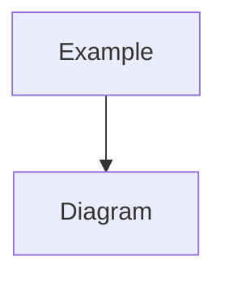

## Basic Explanation

Explain what it is, what problem it solves, and the core mental model.

## Detailed Explanation

### Invariant / Core Property

State what must always remain true.

### Asymptotic Analysis

| Operation | Time | Space |
| --- | --- | --- |
| ... | ... | ... |

### When To Use / Avoid

- Use when ...
- Avoid when ...

## Illustration



## Pseudocode

```text
<algorithm pseudocode>
```

## Full Examples

<div class="code-tabs">
<div class="tab-panel" data-lang="python" markdown="1">

```python
# runnable, idiomatic Python example
```

</div>
<div class="tab-panel" data-lang="rust" markdown="1">

```rust
// runnable, idiomatic Rust example
```

</div>
<div class="tab-panel" data-lang="go" markdown="1">

```go
// runnable, idiomatic Go example
```

</div>
</div>

## References

- Official docs/specs/papers where applicable.
